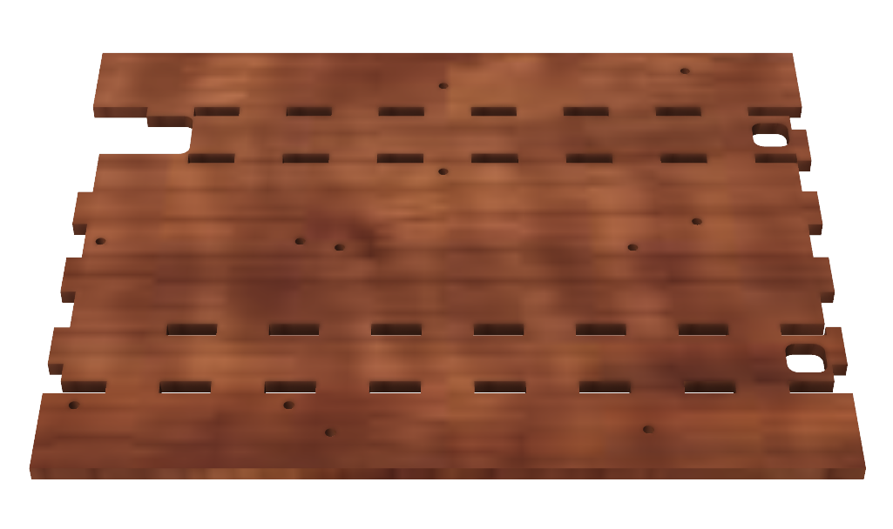
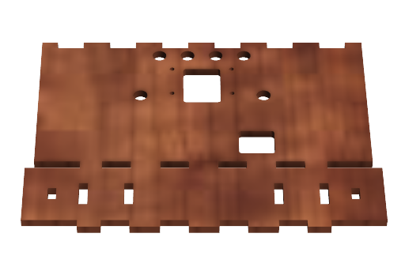
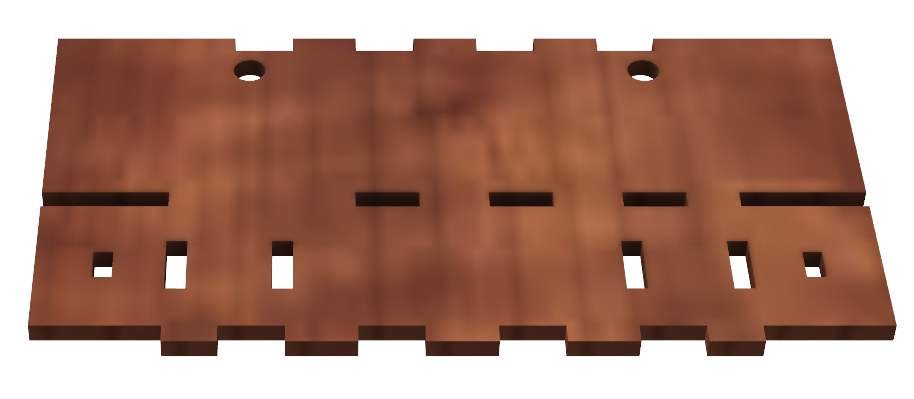
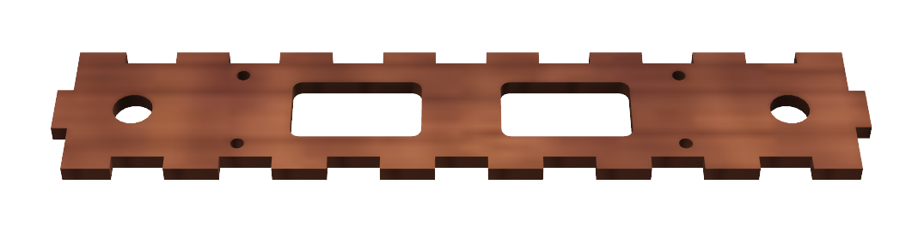
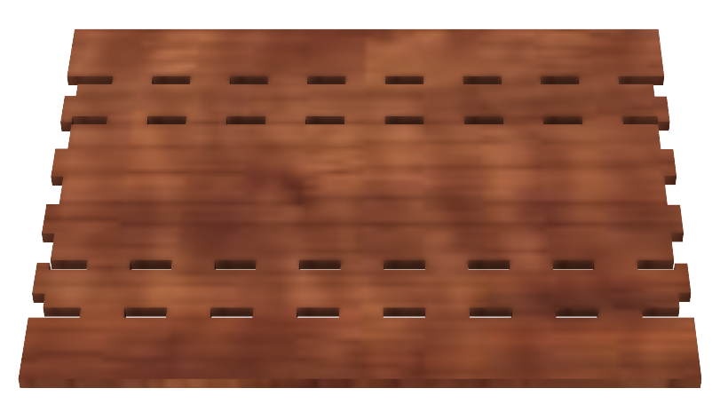
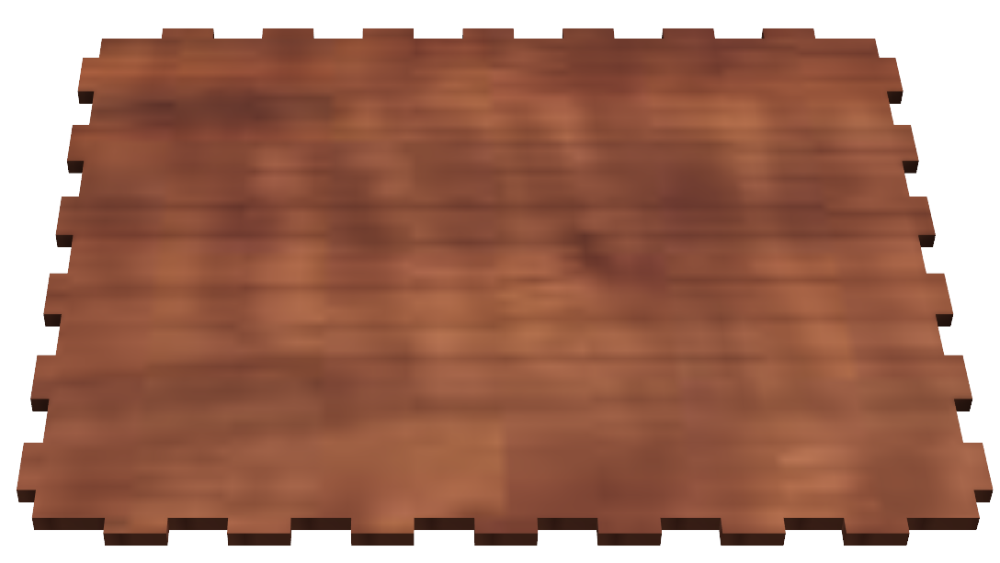
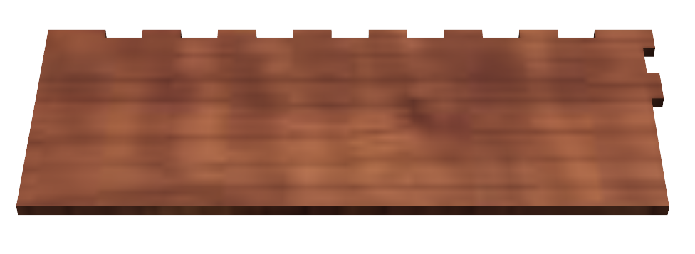
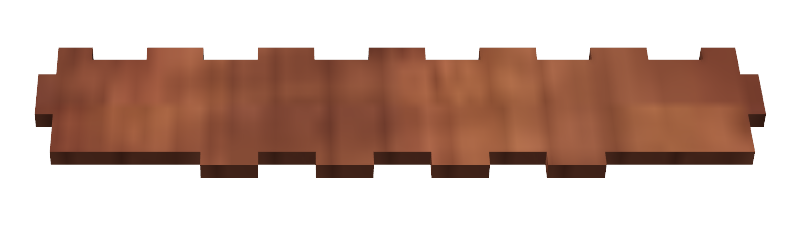

# Laserkutting
For laserkutting av deler til prosjektet anbefales det å bruke [laserkutteren](https://confluence.omegav.no/display/OV/Laserkutter+Bodor+BCL-1309XU) på Omega Verksted. For å bruke denne er det bare å stikke innom verkstedet under [åpningstid](https://omegav.no/door) og spørre et styremedlem om å få bruke laserkutteren evt. send en melding på [Slack](https://join.slack.com/t/omegav/shared_invite/zt-326bd3q9-o95FI1MhBBoO9CpsfS4ygA) og spør i kanalen "Generelt". Om du ikke har laserkuttet før bør kan du også be om en rask opplæring da det tar ca. 10 minutter. Instruksjoner finner man også på [denne]((https://confluence.omegav.no/display/OV/Laserkutter+Bodor+BCL-1309XU)) siden under "Korleis laserkutte/gravere"

Når det kommer materiale skal dere bruke 3mm MDF, kjøp heller hele plater dersom du skal laserkutte en del da dette ofte er billigere enn å betale per areal (MDF - 3mm - Hel Plate). Da disse platene kommer på ca. 100cm x 70cm skal det ligge ulike optimaliserte [maler](DXF/Kits) klare for kutting slik at du enkelt skal kunne kutte på de hele platene som er der, her skal det være maler for alt av 1-5 fullstendige kits. Du kan også finne de alle de forskjellige platene sepparat i [denne](DXF/Single) mappen dersom du ikke skulle behøve å kutte hele kits, men bare enkelte påfyll. Malene er lagt slikt at man skal starte kutting fra øverse venstre hjørne av platen, men det er ikke så farlig om man starter fra et av de andre hjørnene. Kutteparametere kan man finne på [denne](https://confluence.omegav.no/display/OV/Kutteparametere) siden under MDF - kutt - 3mm, men etter litt testing har Power%: 45 og Speed: 30 fungert bra da dette halverer kuttetiden. Dobbeltsjekk kutteparameterne med å kutte ut en liten firkan først for å se om kuttet blir bra, juster evt. opp power eller ned hastigheten. Liten protip: om kuttet ikke går fullstendig igjennom kan du bare la være å flytte på platen og kjøre samme kutt, bare med høyere hastighet da maskinen vil kjøre en ny pass over det forrige kuttet ;). 

Dette er det som trengs per gruppe:
| Hva                      | Antall | Bilde                                        |
|--------------------------|--------|----------------------------------------------|
| Hovedkontrollplate       | 1      |       |
| Frontpanel               | 1      |               |
| Bakpanel                 | 1      |                 |
| Motorfesteplate          | 2      |         |
| Batteristøttebrakett     | 2      |   |
| Chassisbunnplate         | 1      |         |
| Toppdekselplate          | 1      |          |
| Sidedekselplate          | 2      |          |
| Bakdekselplate           | 1      |           |
