# Teknostart 2023

I denne teknostarten skal dere i en gruppe lage en fjernstyrt bil. Dere skal få jobbe med Raspberry Pi, Arduino Uno og LOBE. Det er ikke forventet at du skal kunne noe om dette fra før eller vite hva det er, teknostart vil fungere som en introduksjon til dette.  Dere skal også bygge bilen, koble den opp få alt til å fungere sammen. 
I år er det tre konkurranser. Dere kan vinne ved å være raskest rundt en definert bane, ha den beste objektgjenkjenningen eller ved å ha den vakreste/kuleste bilen. Bruk kreativiteten, maling og tusjer til å skreddersy bilen slik dere ønsker. 
Dere bør dele dere opp og jobbe på hver deres del. Dere har god tid på oppgaven, så det går fint å jobbe i par og ta seg tid til å prøve å forstå eller finne ut mer om noe dersom dere synes det er interessant. En viktig del av teknostart er å samarbeide godt og fordele arbeidsoppgaver. Vi foreslår at dere fordeler dere på disse hovedoppgavene:

1.	Den som ønsker en utfordring, kan jobbe med Raspberry Pien. Her er det viktig å holde tungen beint i bunnen og følge oppskriften til punkt og prikke for at ting skal fungere. Får dere problemer her, ta kontakt med en student assistent. 
2.	En annen oppgave er å sette opp Arduinoen med motordriver, og laste opp den ferdigskrevne koden. 
3.	Til slutt kan dere alle samarbeide om å koble alt sammen og få bilen til å fungere sammen. Vent på en studass før dere får batteriet og får startet bilen. 
4.	Når dere har bygget ferdig bilen kan dere gå videre med utvidelsesoppgavene og begynne å skreddersy den estetisk slik dere ønsker.


## Innholdsfortegnelse
- [Introduksjon til komponentene](#introduksjon-til-komponentene)
- [Trinnvisveiledning for montering av Teknobilen](#Trinnvis-veiledning-for-montering-av-Teknobilen)
  - [Montering av Teknobilen](#Montering-av-Teknobilen)
  - [Raspberry Pi Oppsett](#raspberry-pi-oppsett)
  - [Arduino](#arduino)
- [Utvidelser](#utvidelser)
  - [Hastighet](#hastighet)
    - [Kode](#kode)
    - [Omkobling av motorspenning](#omkobling-av-motorspenning)
  - [Lys](#lys)
  - [Tutehorn](#tutehorn)
  - [Lobe](#lobe)


# Introduksjon til komponentene

Settet dere har fått utdelt inneholder komponenter som sikkert er nye for mange av dere. Her er en liten gjennomgang som forklarer hva de gjør. Det er ikke nødvendig å lese denne biten så nøye, men dere kan se over for å skjønne hvilke komponenter vi omtaler i instruksene.

## Breadboard

Et breadboard gir en rask måte å koble opp kretser for prototyping uten å måtte lodde eller lage kabler. Hver rad i breadboardet er koblet sammen slik at alt som kobles til samme rad er koblet til samme spenningen.

<p align="center">
  
</p>

## Spenningsregulator

Komponenten på bildet under er en spenningsregulatoren. Denne er viktig for Pi-en tåler ikke høyere spenning enn 5 V, men batterispenningen er på over 7 V. Denne har da til formål å senke spenningen slik at både Arduino og Raspberry Pi kan drives fra samme kilde. [Her](https://wiki.dfrobot.com/Power_Module__SKU_DFR0205_) er lenke til dokumentasjon.

<p align="center">
  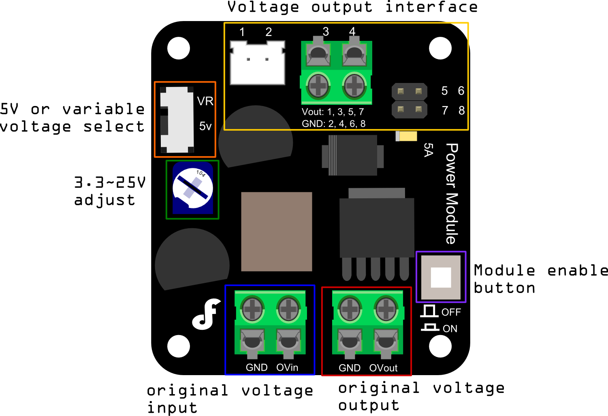
</p>

## Arduino Uno

Arduino Uno er et lite utviklingskort som egner seg godt som første mikrokontroller å lære seg å bruke. For å programmere denne brukes Arduino IDE, med et eget språk som er en variant av C++. [Her](https://store.arduino.cc/products/arduino-uno-rev3) finner dere mer spesifikasjoner om kortet dere har blitt utdelt.

<p align="center">
  
</p>

## Motordriver

Motordriveren som dere har fått utdelt er et såkalt shield for Arduino Uno. Det betyr at den plasseres rett på Arduino Uno, uten noen ekstra ledninger mellom de to. Denne må i tillegg kobles til motorspenning og til motorene den skal kontrollere. [Her](https://wiki.dfrobot.com/Quad_Motor_Driver_Shield_for_Arduino_SKU_DRI0039) finner dere ekstra dokumentasjon.

<p align="center">
  
</p>

## Raspberry Pi

Raspberry Pi er en lavkostnads, kredittkort-størrelse datamaskin, der alt du trenger for å bruke som er en hvilken som helst annen PC eller en monitor/TV, et tastatur, og en mus. Den klarer alt som er å forvente av en PC, i alt fra websurfing til å spille av høydefinerte videoer, spill og mye mer. Videre kan Raspberry Pi samhandle med resten av verden, og har blitt brukt til en rekke digitale skaper-prosjekter. Disse prosjektene tar på alt fra musikkskaping og værstasjoner til selvkjørende droner og fuglehus som poster på Instagram. I dette prosjektet brukes modellen Raspberry Pi 3B+. [Her](https://www.raspberrypi.com/documentation/) finner dere mer dokumentasjon om Raspberry Pi.

<p align="center">
  
</p>


# Trinnvis veiledning for montering av Teknobilen
Før dere starter monteringen av bilen, ønsker vi å gi dere en kort introduksjon til funksjonaliteten til Teknobilen. Dette vil gi dere en bedre forståelse av hvordan Arduino og Raspberry Pi samarbeider for å gi bilen sine kjøreegenskaper.

Teknobilen bruker Arduino til å kontrollere motorene, mens Raspberry Pi fungerer som hjernen i systemet der den hoster en nettside som et brukergrensesnitt som tillater oss å styre bilen.

For å oppnå kommunikasjon mellom Raspberry Pi og Arduino, bruker dere GPIO-pinner. Disse pinnene lar dere sende styringskommandoer fra Raspberry Pi til Arduino, som deretter styrer motorene basert på disse instruksjonene.

Gjennom kombinasjonen av Arduino og Raspberry Pi kan dere utforske spennende funksjoner som motorstyring, lyskontroll og objektgjennskjenning.

Nå som dere har fått en kort forklaring på funksjonaliteten til Teknobilen, er dere klare til å starte monteringen. Følg instruksjonene nøye, koble sammen komponentene riktig, og gled dere til å oppleve de morsomme og interaktive egenskapene til Teknobilen!

## Montering av Teknobilen

Følg trinnene nedenfor nøye for å montere Teknobilen . Alle bilder nevnt i veiledningen kan finnes i mappen [teknobil2023/-/tree/main/Media/teknobil](https://github.com/PeterhdPham/Teknostart/tree/main/Media/teknobil).

### Steg 1: Montering av motorer

Start med å feste motorene til følgende plater med de 25 mm lange M3 skruene. 
(NB! Ettersom vi ikke benytter muttere vær oppmerksom på ikke å stramme skruene for hardt).

<p align="center">
  
</p>

### Steg 2: Sammensetting av baseplate og avlange plater

Fest så de avlange platene sammen med baseplaten (den store med hull). Pass på at baseplaten er riktig vei som vis på bildet slik at hullene passer med komponentene som skal skrus på senere.

<p align="center">
  
  
</p>

### Steg 3: Ledninger

Nå kan det være lurt å føre ledningene fra motorene igjennom de to firkantede hullene i baseplaten.

<p align="center">
  
</p>

### Steg 4: Montering av bunnplate

Fest bunnplaten.

<p align="center">
  
</p>

### Steg 5: Raspbian

Før dere fortsetter med å feste komponentene bør oppsettet av Raspberry Pi være ferdig, ettersom man ikke vil få tilgang til SD-kortet etter at alt er skrudd på plass. Dere bør ha fullført dette steget [her](#sette-opp-sd-kortet).

### Steg 6: Montering av komponenter

Legg komponentene som vist på bildet og skru dem fast inn i baseplaten med de 10 mm lange M2.5 skruene.

<p align="center">
  
</p>

### Steg 7: Montering av frontplate og kamera

Fest frontplaten og skru fast kameraet til platen med de 4 mm lange M2 skruene som vist på bildet under.

<p align="center">
  
  
</p>

Koble kamera til Raspberry Pi med den flate kamerakabelen som vist på bildet under. Sørg for å sette den inn riktig vei.

<p align="center">
  
</p>

### Steg 8: Oppkobling av spenningskilde

Koble motordriver, Arduino og Raspberry Pi til 5 V på spenningsregulatoren som vist på bildene under.

<p align="center">
  
  
  
</p>

### Steg 9: Oppkobling av GPIO

For å koble sammen Raspberry Pi og Arduino Uno.
Merk at nummeret på GPIO pinnen er ikke det samme som nummeret langs pinneraden på kortet som beskriver hvor pinnen er plassert. GPIO pinout for Raspberry Pi og tabell for sammenkobling med Arduino er vist under. Bruk dette til å koble sammen de to kortene.

<p align="center">
  
</p>

| Arduino | Raspberry Pi |
|---------|--------------|
| A5      | GPIO 21      |
| A4      | GPIO 13      |
| A3      | GPIO 19      |
| A2      | GPIO 26      |
| GND     | GND          |

Har dere koblet riktig skal det se ut som vist under.

<p align="center">
  
</p>

### Steg 10: Kontroll og kobling av batteri

Batterikonnektor til spenningsregulator kobles opp som vist under.

<p align="center">
  
</p>

Når alt er koblet opp kan dere få bilen deres kontrollert hos en læringsassistent. Dersom alt er korrekt kan dere få utlevert et batteri, den skyves inn mellom motorene før dere fester bakplaten. 

NB: Her er det to viktige ting å passe på. Pass på at skruene som holder kretskortene på plass ikke er skrudd såpass stramt at batteriet tar skade når det skyves inn i bilen. Det er viktig å være obs på at man ikke skrur de inn i batteriet senere heller, ellers kan batteriet begynne å brenne. Pass på at bryteren er satt til 5 V på spenningsregulatoren før dere skrur den på.

<p align="center">
  
  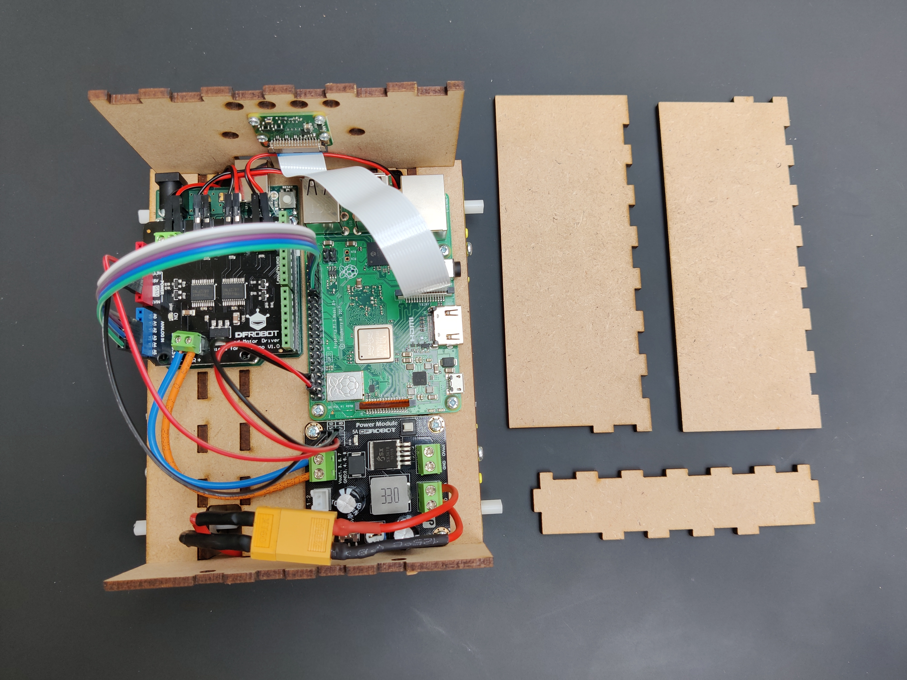
</p>

### Steg 11: Montering av bakplate og topplokk

Fest bakplaten og sett på topplokket. Bilen skal nå se ut som vist under.

<p align="center">
  
</p>

Lykke til med monteringen!


## Raspberry Pi

I dette prosjektet brukes modellen Raspberry Pi 3B+. Den brukes til å lage en webserver som streamer live-video fra et Raspberry kamera, hvor du, mens du er i nettleseren, kan bruke piltastene til å styre bilen. Dette gjøres ved at du sender informasjon om tastetrykk til Pi-en, og denne sender videre informasjon til Arduinoen, som er et mikrokontrollerkort. I dagligtale er det, i et slikt prosjekt, vanlig å kalle Pien for hjernen, som bruker Arduino som slave.
Som alle andre datamaskiner har denne også et operasjonssystem, eller OS. Raspberry Pi sitt OS ligger på et SD-kort, som er mulig å ta ut og inn. Dette SD-kortet fungerer også som maskinens harddrive. Derfor er det naturlig at prosessen med å klargjøre Raspberry Pi-en starter i å sette opp SD-kortet.

### Sette opp SD-kortet

Utstyr:

- Laptop
- SD-kort
- SD-kortleser

SD-kortene dere har fått utdelt inneholder ingen informasjon dere kan bruke. Derfor må dere starte med å laste opp et OS til dette kortet. RPi bruker ikke Windows eller MacOS, men et operativsystem som ofte kalles Rasbian/Debian, som er en versjon av Linux. For å kunne laste opp dette OS-et til kortet kreves et eget skrivebordsprogram som heter Raspberry Pi Imager.

Slik går du fram for å sette opp SD-kortet:

1. Last ned Raspberry Pi Imager
2. Sett inn SD-kortet inn i SD-kortleseren
3. Åpne Raspberry Pi Imager
4. Trykk på «CHOOSE OS» og velg: «Raspberry Pi OS (32-bit)»
5. Videre «CHOOSE STORAGE», og velg det SD-kortet du satte inn.
6. Gå inn på settings:

   

   1. Sett hostname til «ELSYS"gruppenummer"», eksempel: ELSYS14
   2. Enable SSH
      - Use password authentication
   3. Set username and password
      - Username: teknostart, NB: viktig at dere kun skriver “teknostart”
      - Password: "123", eller noe annet dere lett kan huske
   4. Configure wireless LAN
      - NB: SSID og Password må være likt det nettet dere kan dele fra mobilen
   5. Enable Set locale settings:
      - Time zone: Europe/Oslo
      - Keyboard layout: no
   6. Når du er ferdig skal du se noe tilsvarende:

   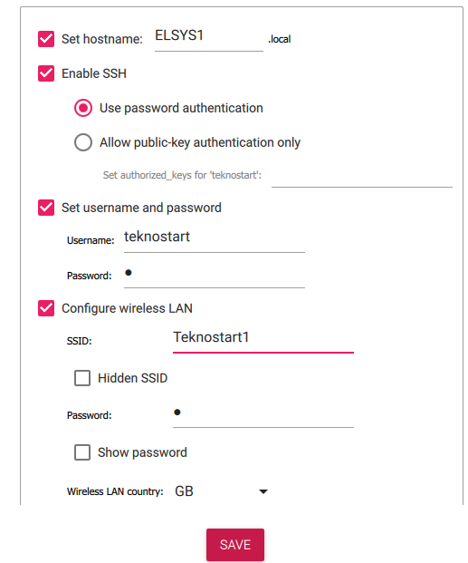

7. Lagre innstillingene, og trykk på write, dette kan ta litt tid.
8. Når SD-kortet er ferdig skrevet vil du få en beskjed om at det er trygt å ta det ut av maskinen. Ta det ut, og sett inn i Pi-en.


### Sette opp Raspberry Pi headless
Som sagt er Raspberry Pi en datamaskin, men som du kanskje ser er det ikke akkurat en laptop. Det fine med Raspberry Pi er at den kan settes opp og styres headless, altså at man verken trenger et eksternt monitor eller tastatur. For å bruke den headless tar vi i bruk Secure Shell Protocol eller også kjent som SSH, som du aktiverte i “Advanced options”. For å koble til Pi-en fra PC med SSH må begge to være koblet på samme nettverk. Derfor skal vi dele nett fra mobilen, og koble oss til dette nettet med både Pi og PC.

Utstyr:
- PC
- Raspberry Pi med ferdig installert SD-kort
- Delt nett

#### SSH inn til Raspberry Pi

1. Først må Pi-en være koblet til strøm, dette gjøres enten ved oppkobling i bilen eller ved microUSB porten på kortet
2. Åpne en terminal på laptopen:
   - For Windows kan dere søke opp:
     - Terminal (🪟 + x)
     - Windows PowerShell
     - Command Promt
   - For Mac kan dere søke opp:
     - Terminal
3. For å SSH inn til Pi-en går du inn på terminalen og skriver (du kan også copypaste ved å kopiere vanlig for så å lime inn med høyre klikk inne på terminalen.):
   ```bash
   ssh teknostart@<hostname>.local
   ```
   - Som du satte i Raspberry Pi imager F.eks:
     ```bash 
     teknostart@ELSYS1.local 
     ```
     - NB: Det kan ta litt tid før Pi-en skrur seg på, så om den ikke finner Pi-en med en gang så bare vent noen minutter og prøv igjen
     - Når den spør om du ønsker å koble deg til skriver du “yes” og trykker enter
     - Du vil få noe tilsvarende:
     

Gratulerer du har nå SSH-et inn til deres Raspberry Pi. Kommandoene du nå skriver skjer inne på selve Raspberry Pi.


#### Få inn riktig programvare

Vi skal nå få inn riktig programvare, samt laste inn alt av kode som skal ligge lokalt på Pi-en.

1. Start med å sjekke at klokken inne på Raspberry Pien stemmer med kommandoen:

```bash
date
```
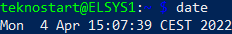
    * Dersom dato og klokken er feil kan du fikse opp i dette ved å bruke kommandoen (Husk å endre dato/klokkeslett til gjeldende tid):

```bash
sudo date -s '18 Aug 2022 13:00'
```
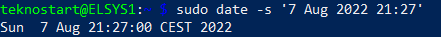

2. Nå kan du oppdatere og oppgradere med kommandoene

```bash
sudo apt-get update
sudo apt-get dist-upgrade
```

- Trykk enter når de spør om du ønsker å fortsette


3. Nå kan du klone git-en som inneholder koden som Raspberry Pi-en skal kjøre med kommandoen:

```bash
git clone https://github.com/PeterhdPham/Teknostart.git
```
    *NB dette kan ta litt tid
4. Videre kan du navigere deg inn på "Teknostart" mappen med kommandoen:
   
```bash 
cd Teknostart/
```

5. Last ned ekstra progrmvare som kreves for å kjøre koden med kommandoen:
```bash
pip3 install -r requirements.txt
sudo apt-get install libatlas-base-dev
sudo apt-get install python3-pyro4
```
6. Naviger videre inn i "projectfolder" med kommandoen:

```bash
cd projectfolder/
```
7. Når Arduino koden er ferdig lastet kan du kjøre Python koden med kommandoen:

```python
python runCode.py
```

Ved å kjøre denne kodelinjen får dere opp en ip-adresse dere kan gå til i nettleser for å få videofeed og kjøre bilen. Når dere skal stoppe koden fra å kjøre, trykk "STOP" i nettleser. For å teste objektgjenkjenningen, trykk "COMPARE".

* Dersom dere får opp en feilmelding om at kamera ikke er enabled:
  - Trykk Ctrl+C for å avbryte kjøringen av koden i terminalen
  - Åpne raspi-config:
    ```bash
    sudo raspi-config
    ```
  - Naviger til "Interface Options", deretter "Legacy Camera"
  - Velg "Yes" til å enable kamera
  - Start Pi-en på nytt med
    ```bash
    sudo reboot now
    ```
  - Naviger til mappen der runCode.py ligger og kjør koden på nytt


## Arduino
Arduino er en open-source elektronikkplattform basert på hardware og software designet for å være enkelt å bruke. Arduinokortene er rusta til å lese ulike inputs - lys på en sensor, knappetrykk, en Twittermelding – og bruke denne dataen til å sende et outputsignal – aktivere en motor, skru på en LED, publisere noe på nett. Du kan fortelle kortet hva den skal gjøre, ved å sende opp sett med instruksjoner til mikrokontrolleren på kortet i form av kodesnutter. Disse instruksjonene sendes til kortet via en USB-kabel fra din PC, men for at denne informasjonen skal lastes opp riktig må vi ha koden vår i en Arduino Software (IDE).

### Skaff Arduino Software til egen PC

Last ned Arduino IDE
* [Windows](https://docs.arduino.cc/software/ide-v1/tutorials/Windows#download-the-arduino-software-ide)
* [MacOS](https://docs.arduino.cc/software/ide-v1/tutorials/macOS?_gl=1*17wzpvg*_ga*MTY2NjU1MjEzOC4xNjI5OTYzMDk1*_ga_NEXN8H46L5*MTY1NTIwNjQyMy4zMy4xLjE2NTUyMDk1MTcuNjA.)
* [Linux](https://docs.arduino.cc/software/ide-v1/tutorials/Linux?_gl=1*xpugwf*_ga*MTY2NjU1MjEzOC4xNjI5OTYzMDk1*_ga_NEXN8H46L5*MTY1NTIwNjQyMy4zMy4xLjE2NTUyMDk1NDcuMzA.)

### Last inn koden til Arduinoen
Utstyr:
1. PC
2. Usb-A til usb-b kabel
3. Arduino Uno

Oppsett:
1. Koble til arduino-kortet til din PC med en USB-B ledning
2. Sørg for at softwaren fungerer for riktig type arduinokort, her Arduino Uno
    * Gå inn på «Verktøy»/«Tools»
    * Velg riktig kort og port (porten er hvilken inngang/utgang du bruker på PC-en. Kan komme feilmelding om det velges feil)


3. Videre erstatter du teksten med koden under:
    <details>
    <summary>Klikk her</summary>

    ```c
    //MOTOR SETUP
    const int E1 = 3; ///<Motor1 Speed - Front Right
    const int E2 = 11;///<Motor2 Speed - Front Left
    const int E3 = 5; ///<Motor3 Speed - Back Right
    const int E4 = 6; ///<Motor4 Speed - Back Left
    
    const int M1 = 7; ///<Motor1 Direction - Front Right
    const int M2 = 8;///<Motor2 Direction - Front Left
    const int M3 = 12; ///<Motor3 Direction - Back Right
    const int M4 = 4; ///<Motor4 Direction - Back Left
    
    
    /////////LOGIC/////////////////////////////////
    //INPUT PINS
    int drive = A5;
    int reverse = A4;
    int leftTurn = A3;
    int rightTurn = A2;
    
    //BOOLS
    int go = 0;
    int back = 0;
    int left = 0;
    int right = 0;
    
    
    //SPEEDS
    int drivingSpeed = 150;
    int turningSpeed = 50;
    
    
    //////DRIVING FUNCTIONS//////////////////////
    void speedSet(String motors, int Speed){
    //Choose speed from 0-255
    if(motors == "right"){
        analogWrite(E1, Speed);
        analogWrite(E3, Speed);
        }
    else if(motors == "left"){
        analogWrite(E2, Speed);
        analogWrite(E4, Speed);
    }
    else if(motors = "both"){
        analogWrite(E1, Speed);
        analogWrite(E2, Speed);
        analogWrite(E3, Speed);
        analogWrite(E4, Speed);
    }
    }
    
    //DRIVING FUNCTION
    void driving(String motors, bool Direction){
    //Direction = 0 -> forward
    //Dircetion = 1 -> reverse
    if (motors == "both"){
    Direction = !Direction;
    digitalWrite(M1, Direction);
    digitalWrite(M2, Direction);
    digitalWrite(M3, Direction);
    digitalWrite(M4, Direction);
    }
    else if (motors = "right"){
        digitalWrite(M1, Direction);
        digitalWrite(M3, Direction);
    }
    else if (motors = "left"){
        digitalWrite(M2, Direction);
        digitalWrite(M4, Direction);
    }
    }
    
    
    ////SETUP///////////////////////
    void setup() {
    Serial.begin(9600);   
    Serial.println("Starting session...");
    
    //SET PINS 
    pinMode(drive,INPUT);
    pinMode(reverse, INPUT);
    pinMode(leftTurn, INPUT);
    pinMode(rightTurn, INPUT);
    for(int i=3;i<9;i++)
        pinMode(i,OUTPUT);
    for(int i=11;i<13;i++)
        pinMode(i,OUTPUT);
        
    }
    
    void loop() {
    //UPDATING THE BOOLEANS
    go = digitalRead(drive);
    back = digitalRead(reverse);
    left = digitalRead(leftTurn);
    right = digitalRead(rightTurn);
    
    """
    // Troubleshooting for reliability of RPi GPIO
    Serial.print("RPi control inputs:   ");
    Serial.print(go);
    Serial.print(back);
    Serial.print(left);
    Serial.print(right);
    Serial.print("    ");
    """
    
    
    /////FORWARD DRIVE/////////////////////////////////////////
    if(go && !back){  
        driving("both", 0);  
        //FORWARD WITH A RIGHT TURN
        if(right){
        speedSet("right",turningSpeed);
        }
        //FORWARD WITH A LEFT TURN
        else if(left){
        speedSet("left",turningSpeed);
        }
        else{
        speedSet("both", drivingSpeed);
        Serial.println("FORWARD");
        }
    }
    
    
    //REVERSE
    else if(back && !go){
        driving("both", 1);
        //REVERSE WITH RIGHTTURN
        if(right){
        speedSet("right",turningSpeed);
        }
        //REVERSE WITH LEFTTURN
        else if(left){
        speedSet("left", turningSpeed);
        }
        else{
        speedSet("both", drivingSpeed);      
        Serial.println("REVERSE");
        }
    }
    
    
    
    //RIGHTTURN
    else if(right && !go && !back){
        speedSet("both", turningSpeed);
        if(!left){
        digitalWrite(M1,1);
        digitalWrite(M3,1);
        digitalWrite(M2,0);
        digitalWrite(M4,0);
        //driving("left", 0);
        Serial.println("RIGHTTURN");
        }
        
        //IF YOU PRESS BOTH LEFT AND RIGHT
        else{
        driving("both", 0);
        }
    }
    
    //LEFTTURN
    else if(left && !go && !back){
        speedSet("both", turningSpeed);
        if(!right){
        digitalWrite(M1,0);
        digitalWrite(M3,0);
        digitalWrite(M2,1);
        digitalWrite(M4,1);
        //driving("right",0);
        //driving("left", 1 );
        Serial.println("LEFTTURN");
        }
    
    //IF YOU PRESS BOTH LEFT AND RIGHT
        else{
        driving("both", 0);
        }
    }
    
    //IF YOU DON'T PRESS ANYTHNIG
    else{
        speedSet("both", 0);
        Serial.println("STOP");
    }
    }
    </details>

4. Last opp koden til arduinokortet. Blå først for å verifisere koden (dobbeltsjekke at det ikke er noen feil med koden). Deretter rød for å laste opp.


NB: Om motoren skulle gått i feil retning når dere tester full oppkobling, er det trolig noe feil i oppkoblingen (enten feil motor til feil port, eller feil på +/- på motordriverens innganger). Dette kan dere prøve å endre på selv i arduino-koden under «MOTOR SETUP», for å slippe å gjøre omkoblinger, og for en liten ekstra utfordring. :)


# Utvidelser

Når dere er ferdig med å bygge bilen er på tide å skreddersy bilen og legge til de utvidelsene dere ønsker. Utvidelsene er her listet i en rekke følge vi mener går fra lavest til høyest nivå, men dere kan gjøre hvilke dere vil i den rekkefølgen dere ønsker. Dere kan også velge om dere heller vil hoppe over utvidelsene og begynne rett på dekorasjonen. Dersom dere har andre ideer til utvidelser og har behov for andre komponenter enn det som er tilgjengelig, hør med en læringsassistent. Platene kan kuttes, bores og lekes med slik dere ønsker, men husk at elektronikken inni skal gjenbrukes til neste år også. 


## Hastighet

Det er mulig å endre hastigheten til bilen både i Arduino koden og med å koble om motorspenningen. Økt hastighet vil kunne være en stor fordel dersom dere ønsker å vinne raskeste bil. Men sørg for å teste underveis slik at dere fremdeles har kontroll.

### Kode

Hastigheten til bilen er definert i Arduino koden i linjene under.

```c
//SPEEDS
int drivingSpeed = 150;
int turningSpeed = 50;
```

Bla ned til du finner dette i koden din og lek med tallverdiene. For hvilke verdier er bilen raskest?

### Omkobling av motorspenning

En annen måte å øke hastigheten til bilen er ved å øke spenningen til motorene. Slik bilen er koblet opp nå er motordriveren koblet til 5 V fra regulatoren, samme som Arduino og Raspberry Pi. Vi kan derimot ganske enkelt koble om spenningen til motordriveren slik at den er koblet direkte på batterispenningen. Bruk dokumentasjonen for spenningsregulatoren som du finner [her](https://wiki.dfrobot.com/Power_Module__SKU_DFR0205_) til å gjøre dette.


## Lys
Noen kjørelys vil gjøre at bilen deres ser enda fetere ut. De er i tillegg praktiske når dere kjører i mørket og gjør bilen mye tryggere for deg og alle andre i trafikken. 

Får å vite hvordan noe elektronikk skal kobles opp er det svært nyttig med et kretsskjema. Da bruker vi ulike symboler for de forskjellige komponentene og viser hvordan de kobles sammen. Under er kretssymbolet for en motstand vist til venstre og kretssymbolet for en LED vist til høyre. Merk at det er viktig hvilken veg en LED plasseres. Står den feil veg vil den ikke lyse.

<p align="center">
  
  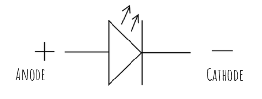
</p>

Det er allerede lagt inn i koden at Raspberry Pi-en setter GPIO pinne 23 høy når bilen kjører fremover og GPIO pinne 18 høy når bilen kjører bakover. Det dere dermed mangler for å ha fungerende kjøre- og ryggelys er å koble opp noen LED til breadboardet deres og koble LED-ene dere plasserer foran til GPIO 23 og LED-ene plassert bak til GPIO 18. Et kretsskjema er vist under. Bruk motstander på mellom 100 og 330 Ohm. Det skal være utdelt i settet deres.

<p align="center">
  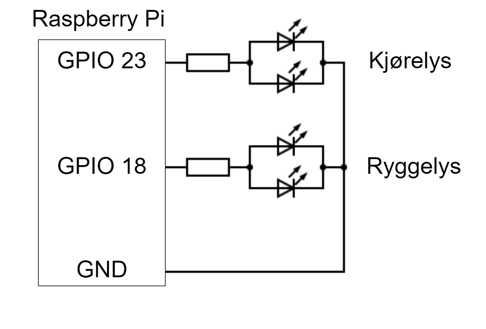
</p>

Det er hull foran og bak på bilen for å montere LED og dere skal ha fått utdelt male-female ledninger som kan brukes for å koble LED-ene til breadboardet.


## Tutehorn

Det er gøy å tute. Det synes alle. Dere kan få en buzzer utdelt fra en læringsassistent. Koden for at dette skal fungere på deres bil er allerede skrevet, men den er kommentert ut i filen runCode.py. Her blir dere nødt til å lese gjennom koden for å finne ut hvordan å få tutehornet til å fungere. Poenget med denne oppgaven er ikke at dere skal forstå all koden, men få erfaring med å endre filene dere har på Pi-en. Programmet runCode er skrevet i programmeringsspråket Python som dere skal lære dere etter hvert.

1. Koble opp buzzeren med den siden som er merket med + til GPIO 21 på Raspberry Pi og den andre siden koblet til GND.
2. Nå må vi endre programmet runCode.py. Nano er en text editor som dere kan kjøre fra terminalen. Åpne runCode i nano.
   
```bash
nano runCode.py
```

I nano kan dere navigere med piltastene og bla ned gjennom koden. I Python kan vi kommentere ut ved å plassere # foran teksten vi ønsker å kommentere. Da kommenterer vi ut den ene linjen vi skriver på. Skal vi kommentere ut flere linjer bruker vi """ <teksten her ignoreres av Python> """.

Den første kodesnutten som er kommentert bort er vist under. Fjern """ begge stedene for at koden ikke skal være kommentert bort.

```p
# ------------------------
"""
# Buzzer setup
BUZZER = 12
GPIO.setup(BUZZER, GPIO.OUT)
buzzer = GPIO.PWM(BUZZER, 1000) # Set frequency to 1 kHz
"""
# ------------------------
```

Det er tre slike kommenteringer som må fjernes. Dere må nå finne de to andre og gjøre det samme med de. De er markert på samme måte som koden over.

3. Når dere har fjernet alle tre kommenteringene lukker dere nano ved å trykk Ctrl+X, deretter Y for å lagre og så Enter. Nå kan dere kjøre koden på nytt og kjøre rundt som før. Når dere trykker Space skal buzzeren spille av en vakker lyd.
4. Nå kan dere prøve å sette en annen frekvens eller duty cycle for buzzeren.


## Lobe

Lag dere egen modell for objektgjenkjenning. Det vi kaller object detection, eller objektgjenkjenning, er en teknikk en datamaskin tar i bruk for å lokalisere objekter i bilder eller videoer. Vi mennesker kjenner fort igjen ulike objekter i bilder og videoer, og skille dem, ila. millisekunder. Målet med object detection er å kunne gjenskape denne egenskapen i en datamaskin. For å få til dette er det ofte tatt i bruk machine learning, som går ut på at maskinen lærer opp seg selv. 
For å slippe å skrive egen kode for dette skal vi benytte et open-source program kalt LOBE. I dette programmet kan en legge inn bilder av de objektene man ønsker at maskinen/programmet skal kunne kjenne igjen, og sette merkelapp på dem. Disse bildene vil så LOBE bruke til å trene opp en modell (type program), til den klarer å kjenne igjen alle objektene den har merkelapp til. Denne modellen, i form av en mappe, legger vi inn på vår RPi, og du vil ha en egenlaget og fungerende gjenkjenningsmodell når du kjører bilen!


###	Last ned LOBE
-	Trykk på Download på denne nettsiden

Bildene som skal brukes til å lage denne modellen skal tas med RPi, og for å få lagret disse lokalt på PC-en skal vi benytte en ny programvare
### Last ned riktig programvare for å kunne ta bilder med RPi
-	git clone https://github.com/silvanmelchior/RPi_Cam_Web_Interface.git
-	cd RPi_Cam_Web_Interface
-	./install.sh
Under nedlastingen vil du få opp denne menyen:
 

Sørg for at alle parametere er like som på bildet over!

### Ta bilder
1.	Start programvaren med å skrive kommandoen /.start.sh i terminalen
2.	Åpne en ny fane i nettleseren og bruk RPi-en sin IP-adresse som nettstedssøk
Hvis du ikke vet IP-adressen fra før kan du finne den med kommando ifconfig

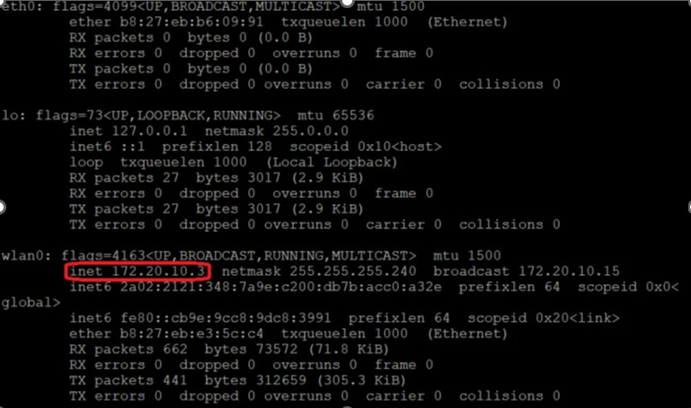

På plassen markert i rødt vil IP-adressen stå

3.	Når du kommer inn på nettsiden følger du linken html. Da burde du komme hit:
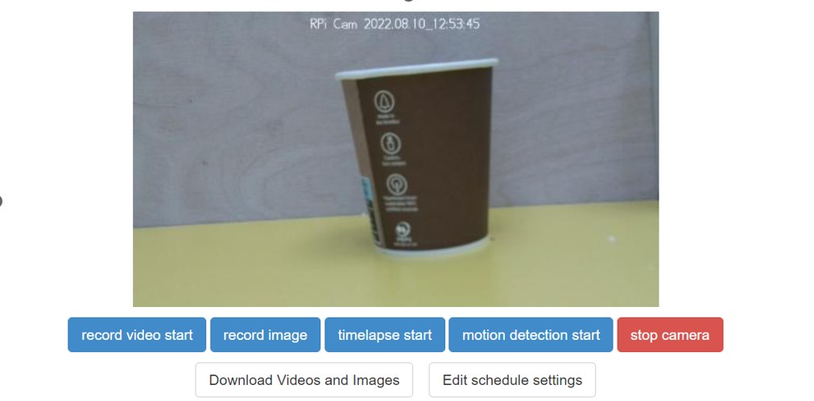 

Om bildet er opp ned kan du gå inn på Camera Settings og sette flip-instillingen til Vertical

4.	Trykk på record image for å ta bilder. Tips for best mulig gjenkjenningsmodell:
-	Ta mange bilder av hvert objekt
-	Helst fra ulike vinkler
-	Kan vurdere ulike bakgrunner/underlag

5.	For å få lastet ned, trykk på Download Videos ond Images  Select All  Get Zip
Denne vil bli lastet ned lokalt på egen PC, velg en filplassering du husker.

### Lag gjenkjenningsmodell
1.	Åpne Lobe
2.	Velg New Project
3.	Inne på Label (i sidemenyen), trykk på Import
-	Her skal du velge de bildene du tok i forrige steg
Tips når du skal sette label (to alternativer):
a)	Last opp bildene til ett objekt om gangen, da kan du markere alle bildene med Ctrl+A, og skrive label for alle bildene samtidig. Dette gjøres ved Import -> Images

b)	Legg alle bildene av samme objekt i en egen mappe, der mappenavnet er labelen til objektet. Sett deretter alle objekt-mappene i en felles mappe. Last opp ved å trykke på Import -> Dataset. Eksempel:


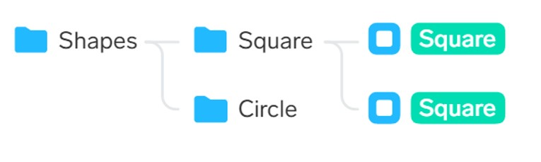

4.	Når alle bildene har fått label, gå inn på Train, og vent til denne har kommet til 100%

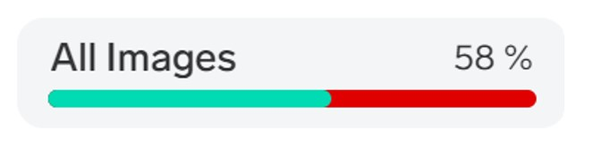

###   Bruk modellen
1.	Gå inn på Use, deretter trykk på export
2.	Velg alternativet TensorFlow Lite, dette vil gi deg en mappe som brukes i koden for RPi-en, derfor er det viktig å gi denne mappen navnet «Lobe», og plassere denne et sted du husker!
3.	For å få denne inn i mappestrukturen til RPi-en deres så modellen deres faktisk blir brukt, må den erstatte den modellen som allerede ligger inne. Derfor er det nødvendig å laste ned et skrivebordsprogram som lar deg overføre filer og mapper mellom to maskiner, her egen PC og RPi

    Windows:
    1.	Last ned WinSCP
    2.	Når nedlastningen er ferdig, åpne programmet
    3.	Skriv inn Vertsnavn (Hostname), brukernavn og passord til RPi-en deres for å få en tilkobling. Det vil da komme opp mappestrukturen til RPi-en på venstre side av programvinduet
    4.	Erstatt Lobe-mappen som ligger på RPi-en fra før, med den du nettopp har laget

    MacOs
    1.	Last ned FileZilla
    2.	Åpne programmet når nedlastningen er ferdig
    3.	Fyll inn Vert (Hostname), brukernavn og passordet til RPi-en deres for å få en tilkobling. Det vil da komme opp mappestrukturen til RPi-en på venstre side av programvinduet
    4.	Erstatt Lobe-mappen som ligger

Når du kjører «runCode.py» fra RPi-en nå, vil den ta i bruk deres egen object detection!!! 
