# Teknostart 2023

I denne teknostarten skal dere, i en gruppe, lage en fjernstyrt bil. Dere skal få jobbe med Raspberry Pi, Arduino Uno og LOBE. Det er ikke forventet at dere skal kunne noe om dette fra før eller vite hva det er; teknostart vil fungere som en introduksjon til dette. Dere skal også bygge bilen, koble den opp, og få alt til å fungere sammen.
I år er det tre konkurranser. Dere kan vinne ved å være raskest rundt en definert bane, ha den beste objektgjenkjenningen, eller ved å ha den vakreste/kuleste bilen. Bruk kreativiteten, maling og tusjer til å skreddersy bilen slik dere ønsker.
Dere bør dele dere opp og jobbe på hver deres del. Dere har god tid på oppgaven, så det går fint å jobbe i par og ta seg tid til å prøve å forstå eller finne ut mer om noe dersom dere synes det er interessant. En viktig del av teknostart er å samarbeide godt og fordele arbeidsoppgaver. Vi foreslår at dere fordeler dere på disse hovedoppgavene:

1.	Den som ønsker en utfordring, kan jobbe med Raspberry Pien. Her er det viktig å holde tungen rett i munnen og følge oppskriften nøye for at ting skal fungere. Får dere problemer her, ta kontakt med en student assistent. 
2.	En annen oppgave er å sette opp Arduinoen med motordriver, og laste opp den ferdigskrevne koden.
3.	Til slutt kan dere alle samarbeide om å koble alt sammen og få bilen til å fungere. Vent på en studass før dere får batteriet og får startet bilen. 
4.	Når dere har bygget ferdig bilen kan dere gå videre med utvidelsesoppgavene og begynne å skreddersy den estetisk slik dere ønsker.


## Innholdsfortegnelse
- [Introduksjon til komponentene](#introduksjon-til-komponentene)
- [Trinnvisveiledning for montering av Teknobilen](#Trinnvis-veiledning-for-montering-av-Teknobilen)
  - [Montering av Teknobilen](#Montering-av-Teknobilen)
  - [Arduino](#arduino)
  - [Raspberry Pi Oppsett](#raspberry-pi-oppsett)
- [Utvidelser](#utvidelser)
  - [Hastighet](#hastighet)
  - [led](#led)
  - [Tutehorn](#tutehorn)
  - [Lobe](#lobe)
****

# Introduksjon til komponentene

Settet dere har fått utdelt inneholder komponenter som sikkert er nye for mange av dere. Her er en liten gjennomgang som forklarer hva de gjør. Det er ikke nødvendig å lese denne delen så nøye, men dere kan se over for å forstå hvilke komponenter vi omtaler i instruksjonene.

## Breadboard

Et breadboard gir en rask måte å koble opp kretser for prototyping uten å måtte lodde eller lage kabler. Hver rad i breadboardet er koblet sammen slik at alt som kobles til samme rad er koblet til samme spenningen.

<p align="center">
  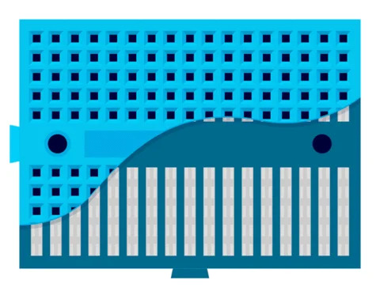
</p>

## Spenningsregulator

Komponenten på bildet under er en spenningsregulatoren. Denne er viktig for Pi-en tåler ikke høyere spenning enn 5 V, men batterispenningen er på over 7 V. Denne har da til formål å senke spenningen slik at både Arduino og Raspberry Pi kan drives fra samme kilde. [Her](https://wiki.dfrobot.com/Power_Module__SKU_DFR0205_) er lenke til dokumentasjon.

<p align="center">
  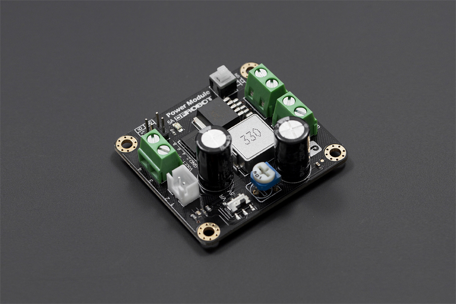
</p>

## Arduino Uno

Arduino Uno er et lite utviklingskort som egner seg godt som første mikrokontroller å lære seg å bruke. For å programmere denne brukes Arduino IDE, med et eget språk som er en variant av C++. [Her](https://store.arduino.cc/products/arduino-uno-rev3) finner dere mer spesifikasjoner om kortet dere har blitt utdelt.

<p align="center">
  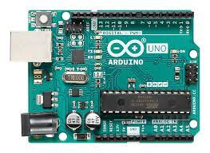
</p>

## Motordriver

Motordriveren som dere har fått utdelt er et såkalt shield for Arduino Uno. Det betyr at den plasseres rett på Arduino Uno, uten noen ekstra ledninger mellom de to. Denne må i tillegg kobles til motorspenning og til motorene den skal kontrollere. [Her](https://wiki.dfrobot.com/Quad_Motor_Driver_Shield_for_Arduino_SKU_DRI0039) finner dere ekstra dokumentasjon.

<p align="center">
  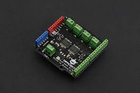
</p>

## Raspberry Pi

Raspberry Pi er en lavkostnads, kredittkort-størrelse datamaskin, der alt dere trenger for å bruke som er en hvilken som helst annen PC eller en monitor/TV, et tastatur, og en mus. Den klarer alt som er å forvente av en PC, i alt fra websurfing til å spille av høydefinerte videoer, spill og mye mer. Videre kan Raspberry Pi samhandle med resten av verden, og har blitt brukt til en rekke digitale skaper-prosjekter. Disse prosjektene tar på alt fra musikkskaping og værstasjoner til selvkjørende droner og fuglehus som poster på Instagram. I dette prosjektet brukes modellen Raspberry Pi 3B+. [Her](https://www.raspberrypi.com/documentation/) finner dere mer dokumentasjon om Raspberry Pi.

<p align="center">
  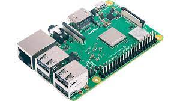
</p>


# Trinnvis veiledning for montering av Teknobilen
Før dere starter monteringen av bilen, ønsker vi å gi dere en kort introduksjon til funksjonaliteten til Teknobilen. Dette vil gi dere en bedre forståelse av hvordan Arduino og Raspberry Pi samarbeider for å gi bilen sine kjøreegenskaper.

Teknobilen bruker Arduino til å kontrollere motorene, mens Raspberry Pi fungerer som hjernen i systemet der den hoster en nettside som et brukergrensesnitt som tillater oss å styre bilen.

For å oppnå kommunikasjon mellom Raspberry Pi og Arduino, bruker dere GPIO-pinner. Disse pinnene lar dere sende styringskommandoer fra Raspberry Pi til Arduino, som deretter styrer motorene basert på disse instruksjonene.

Gjennom kombinasjonen av Arduino og Raspberry Pi kan dere utforske spennende funksjoner som motorstyring, ledkontroll og objektgjennskjenning.

Nå som dere har fått en kort forklaring på funksjonaliteten til Teknobilen, er dere klare til å starte monteringen. Følg instruksjonene nøye, koble sammen komponentene riktig, og gled dere til å oppleve de morsomme og interaktive egenskapene til Teknobilen!

## Montering av Teknobilen

Følg trinnene nedenfor nøye for å montere Teknobilen . Alle bilder nevnt i veiledningen kan finnes i mappen [teknobil2023/-/tree/main/Media/teknobil](https://github.com/PeterhdPham/Teknostart/tree/main/Media/teknobil).

### Steg 1: Montering av motorer

Start med å feste motorene til følgende plater med de 25 mm lange M3 skruene. 
(NB! Ettersom vi ikke benytter muttere vær oppmerksom på ikke å stramme skruene for hardt).

<p align="center">
  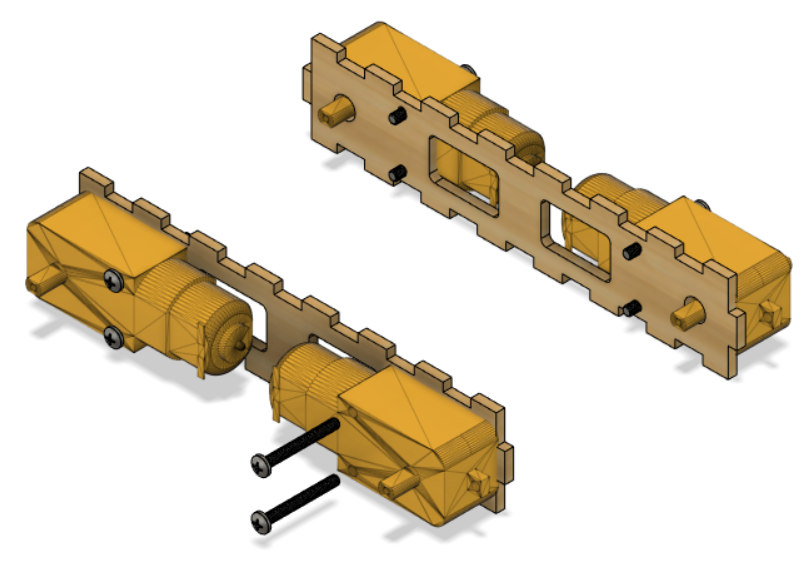
</p>

### Steg 2: Sammensetting av baseplate og avlange plater

Fest så de avlange platene sammen med baseplaten (den store med hull). Pass på at baseplaten er riktig vei som vis på bildet slik at hullene passer med komponentene som skal skrus på senere.

<p align="center">
  
  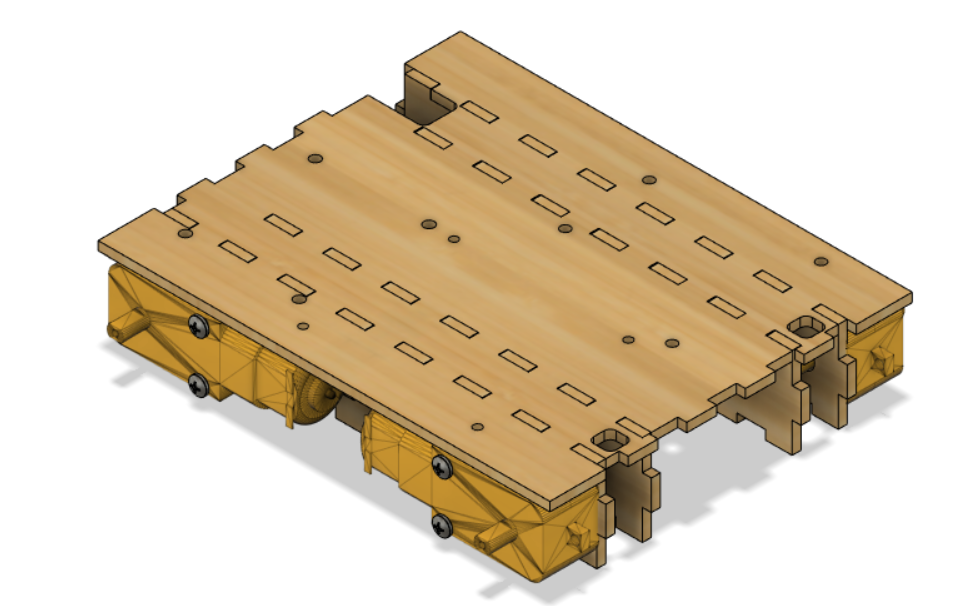
</p>

### Steg 3: Ledninger

Nå kan det være lurt å føre ledningene fra motorene igjennom de to firkantede hullene i baseplaten.

<p align="center">
  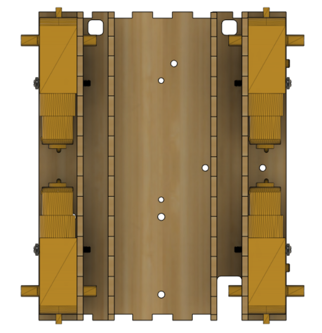
</p>

### Steg 4: Montering av bunnplate

Fest bunnplaten.

<p align="center">
  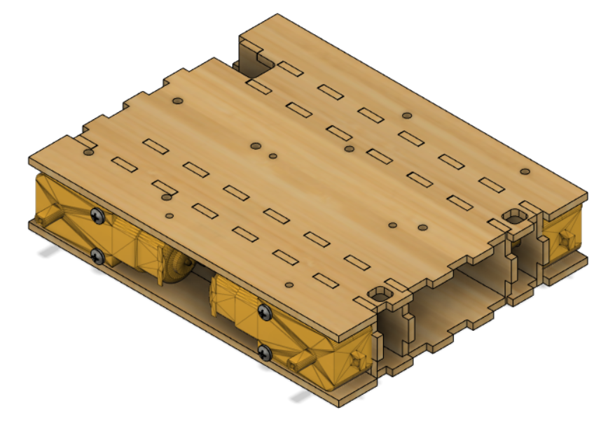
</p>

### Steg 5: Raspbian

Før dere fortsetter med å feste komponentene bør oppsettet av Raspberry Pi være ferdig, ettersom man ikke vil få tilgang til SD-kortet etter at alt er skrudd på plass. Dere bør ha fullført dette steget [her](#sette-opp-sd-kortet).

### Steg 6: Montering av komponenter

Legg komponentene som vist på bildet og skru dem fast inn i baseplaten med de 10 mm lange M2.5 skruene.

<p align="center">
  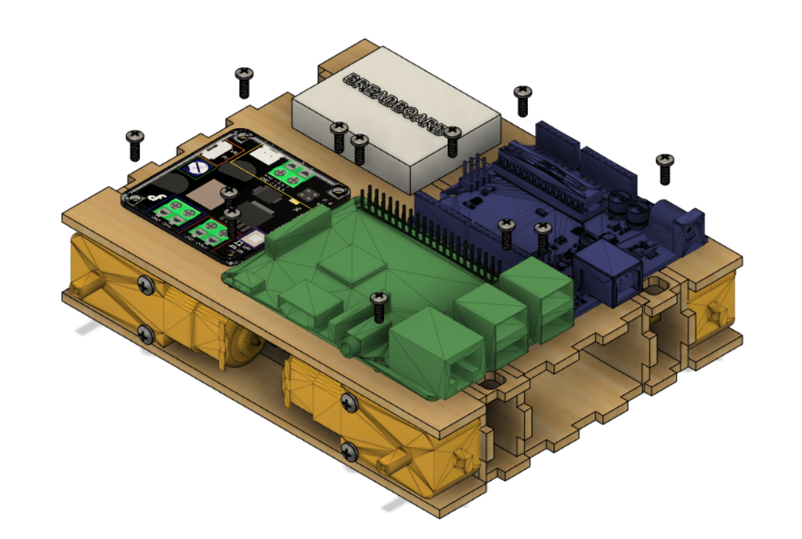
</p>

### Steg 7: Montering av frontplate og kamera

Fest frontplaten og skru fast kameraet til platen med de 4 mm lange M2 skruene som vist på bildet under.

<p align="center">
  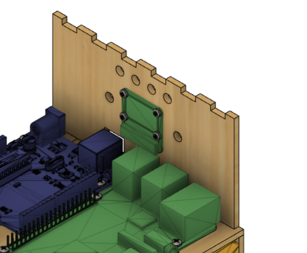
  
</p>

Koble kamera til Raspberry Pi med den flate kamerakabelen som vist på bildet under. Sørg for å sette den inn riktig vei.

<p align="center">
  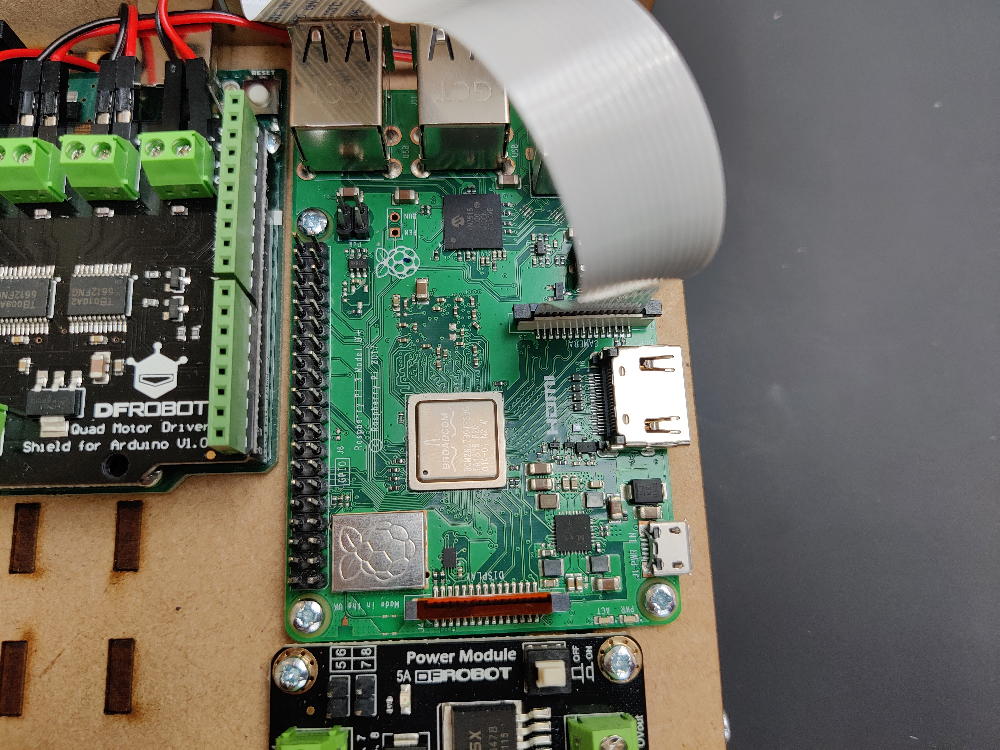
</p>

### Steg 8: Oppkobling av spenningskilde og motor


Vi er nå kommet til et kritisk punkt i prosjektet - det er tid for å koble sammen komponentene. Dette er en nøye prosess og det er avgjørende at dere følger koblingsskjemaene nøye. Ta en god titt på figurene og sørg for at dere har koblet riktig pins mellom spenningsregulatoren og Raspberry Pi samt Arduino.

Under ser dere pinout for Arduino, strømmodulen og Raspberry Pi.

Husk, nøyaktighet er nøkkelen her, så vær tålmodig og dobbeltsjekk alle tilkoblinger før dere fortsetter. I Illustrasjonen under så kobles 


<p align="center">
  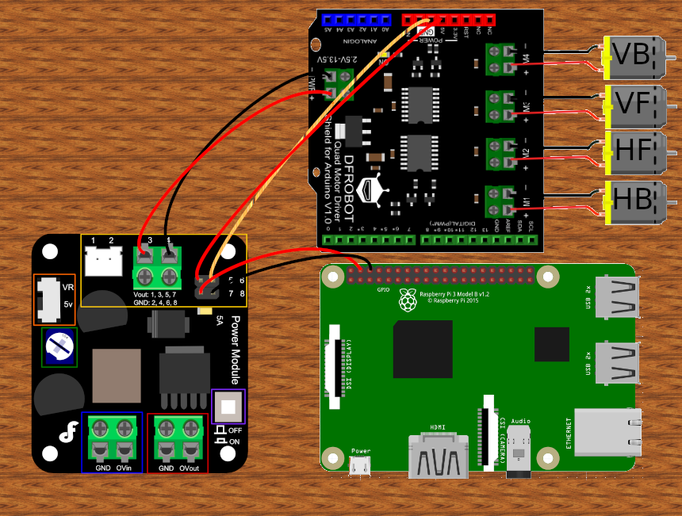
  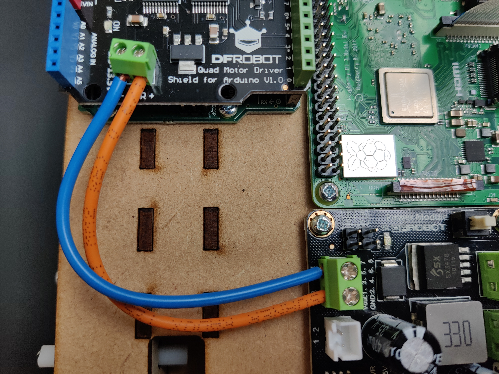
  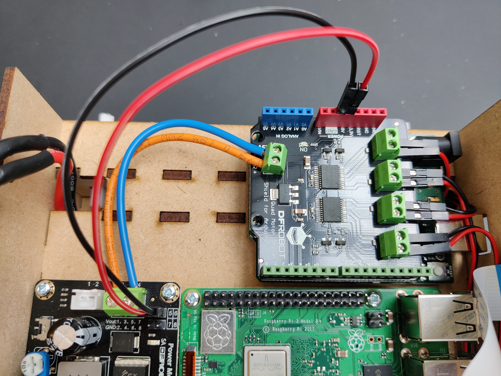
  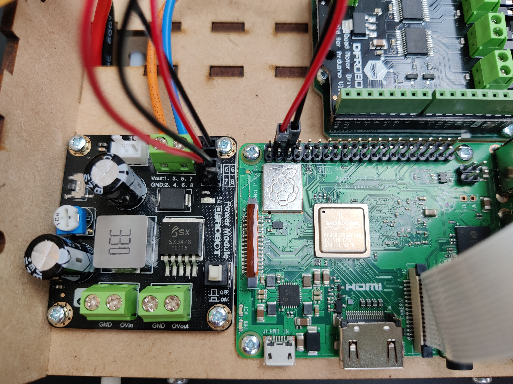
</p>

som vis i illustrasjonen så kobles motorene og komponentene  slikt:

<table>
<tr><td>

| Motorshield | Motor        |
|-------------|--------------|
| M1          | HØYRE BAK    |
| M2          | HØYRE FRONT  |
| M3          | VENSTRE FRONT|
| M4          | VENSTRE BAK  |

</td><td>&nbsp;&nbsp;&nbsp;&nbsp;&nbsp;</td><td>

| Power Module | Arduino/RPI/Motor |
|-------------|--------------      |
| 3 (V_out)   | Motor (+)          |
| 4 (GND)     | Motor (-)          |
| 5 (V_out)   | Arduino (5V)       |
| 6 (GND)     | Arduino (GND)      |
| 7 (V_out)   | RPI (5V PWR)       |
| 8 (GND)     | RPI (GND)          |

</td></tr> </table>


### Steg 9: Oppkobling av GPIO

For å koble sammen Raspberry Pi og Arduino Uno, må dere merke deg at nummeret på GPIO-pinnen ikke er det samme som nummeret langs pinneraden på kortet som beskriver hvor pinnen er plassert. GPIO pinout for Raspberry Pi og tabell for tilkobling med Arduino er vist under. Bruk dette for å koble sammen de to kortene.

<p align="center">
  
  
<table>
    <tr>
        <td>
            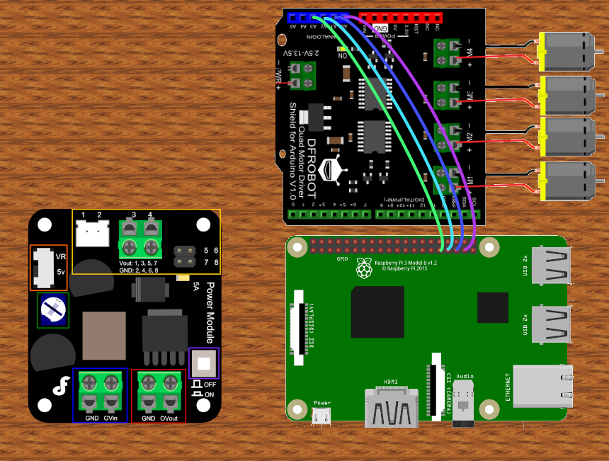
        </td>
        <td>
          
| Arduino | Raspberry Pi |
|---------|--------------|
| A3      | GPIO 21      |
| A2      | GPIO 13      |
| A1      | GPIO 19      |
| A0      | GPIO 26      |


</table>

Hvis dere har koblet riktig, skal det se ut som vist under.

<p align="center">
  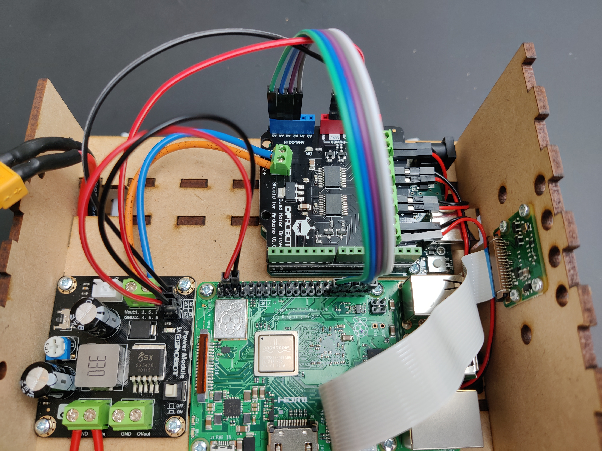
</p>

### Steg 11: Oppkobling av LEDS


Hver LED har to ben; en kort (katode) og en lang (anode), dette tilsvarer LED-ens positive og negative side som vist i illustrasjonen under.

1.  **Koble motstandene til brødfjølet**: Koble en 220-ohms motstand til brødfjølet. Dere vil trenge en for katodene til kjøre-LED og rygge-LED (2 røde og 2 gjennomsiktige), og en annen for de andre LEDene (rødt, gult, grønt, blått).

2.  **Koble til GND**: Koble Raspberry Pi's GND (jord) pinne til brødfjølet, deretter til motstanden(e).

3. **Koble til GPIO-pinnene**: Bruk jumperkabler til å koble anoden (den lengre delen av LED) direkte til de tilsvarende GPIO-pinnene på Raspberry Pi. Katodene (den kortere delen av LED) kobles til brødfjølet (som er koblet til GND gjennom motstanden) ved hjelp av jumperkabler.

Her er den tilsvarende tilkoblingen:

<table align="left" border="0">
    <tr>
        <th>GPIO-tilkoblinger</th>
        <th>Funksjon</th>
    </tr>
    <tr>
        <td>20</td>
        <td>kjøreled (Gjennomsiktig LED)</td>
    </tr>
    <tr>
        <td>21</td>
        <td>kjøreled (Gjennomsiktig LED)</td>
    </tr>
    <tr>
        <td>2</td>
        <td>Ryggeled (Rødt LED)</td>
    </tr>
    <tr>
        <td>3</td>
        <td>Ryggeled (Rødt LED)</td>
    </tr>
    <tr>
        <td>1</td>
        <td>Rødt led</td>
    </tr>
    <tr>
        <td>7</td>
        <td>Gult led</td>
    </tr>
    <tr>
        <td>8</td>
        <td>Grønt led</td>
    </tr>
    <tr>
        <td>25</td>
        <td>Blått led</td>
    </tr>
</table>

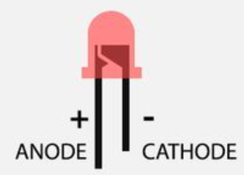
<br clear="all" />


**Viktig:** En motstand er nødvendig for å begrense strømmen som går gjennom LEDene, og dermed hindre dem i å brenne ut. Alltid koble motstanden til katodesiden (den kortere benet) av LEDen.


<p align="center">
  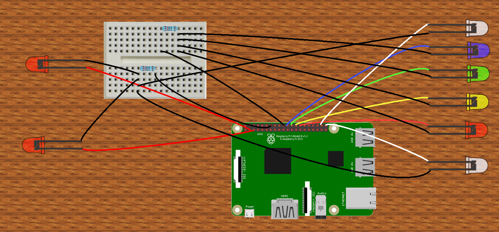
</p>

Illustrasjonen over viser et forslag til hvordan en ferdig krets kan se ut. Bildet under viser hvor kaotisk det kan bli etter at det er ferdig. Lykke til 😈

<p align="center">
  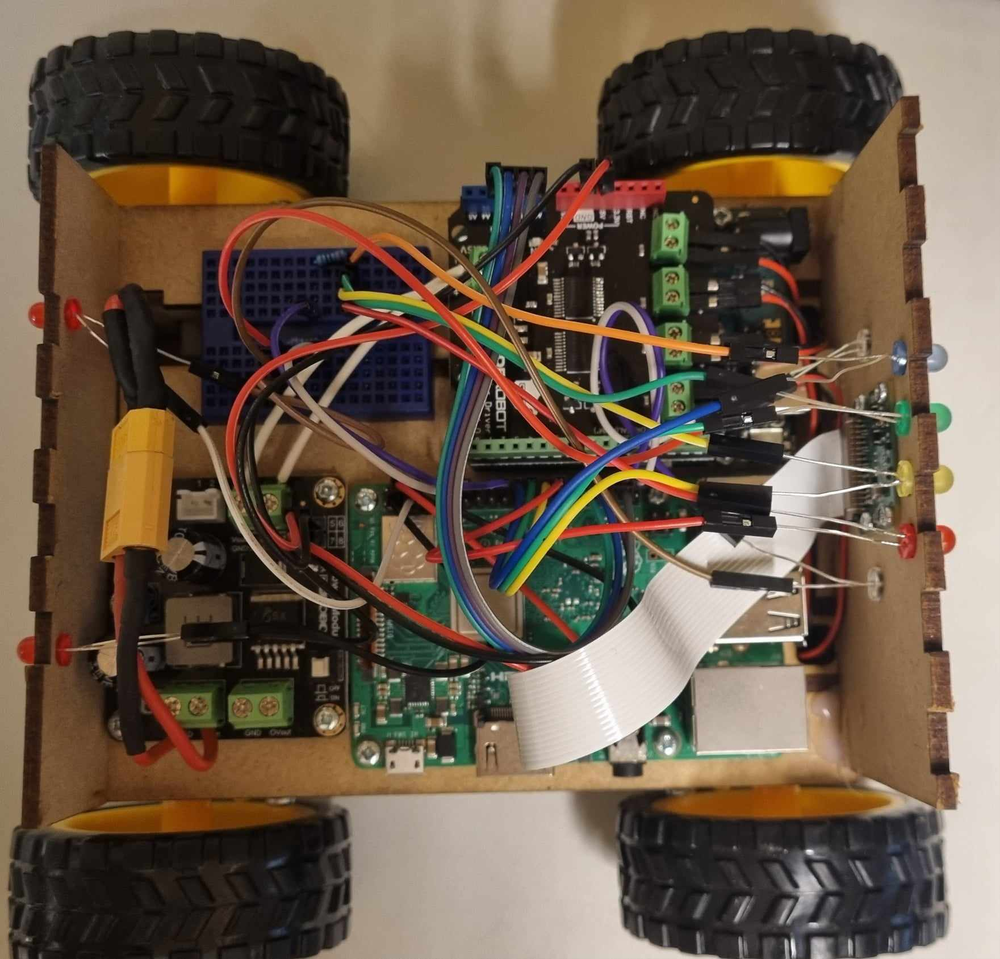
</p>

### Steg 11: Kontroll og kobling av batteri

Batterikontaktoren til spenningsregulatoren kobles opp som vist under. Pass på at den positive (røde) ledningen er koblet til OV_in og den negative (svarte) ledningen er koblet til GND.

<p align="center">
  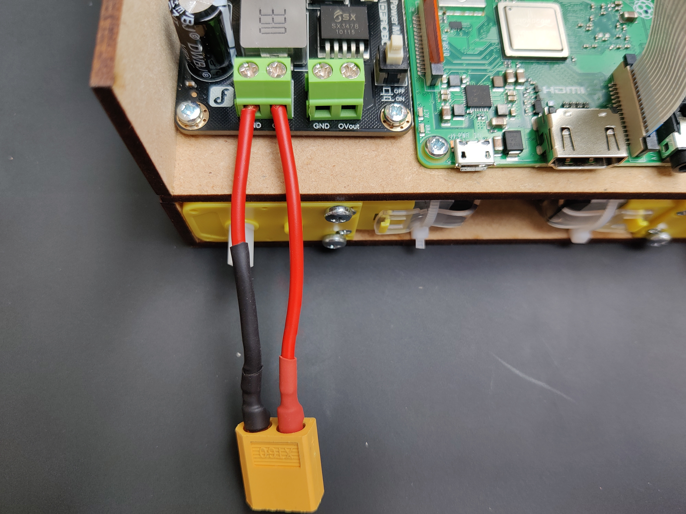
</p>

Når alt er koblet opp, kan dere få bilen deres kontrollert av en læreassistent. Hvis alt er korrekt, kan dere få utlevert et batteri som skal skyves inn mellom motorene før dere fester bakplaten.

NB: Her er det to viktige ting å være oppmerksom på. Pass på at skruene som holder kretskortene på plass ikke er skrudd så stramt at batteriet tar skade når det skyves inn i bilen. Det er også viktig å være forsiktig så man ikke skrur dem inn i batteriet senere, ellers kan batteriet begynne å brenne. Sørg for at bryteren er satt til 5 V på spenningsregulatoren før dere skrur den på.

<p align="center">
  
</p>


<p align="center">
  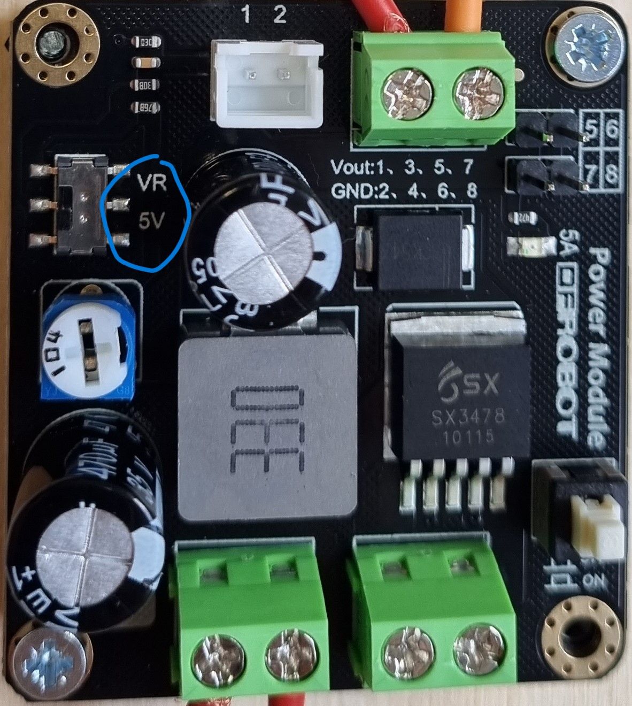
  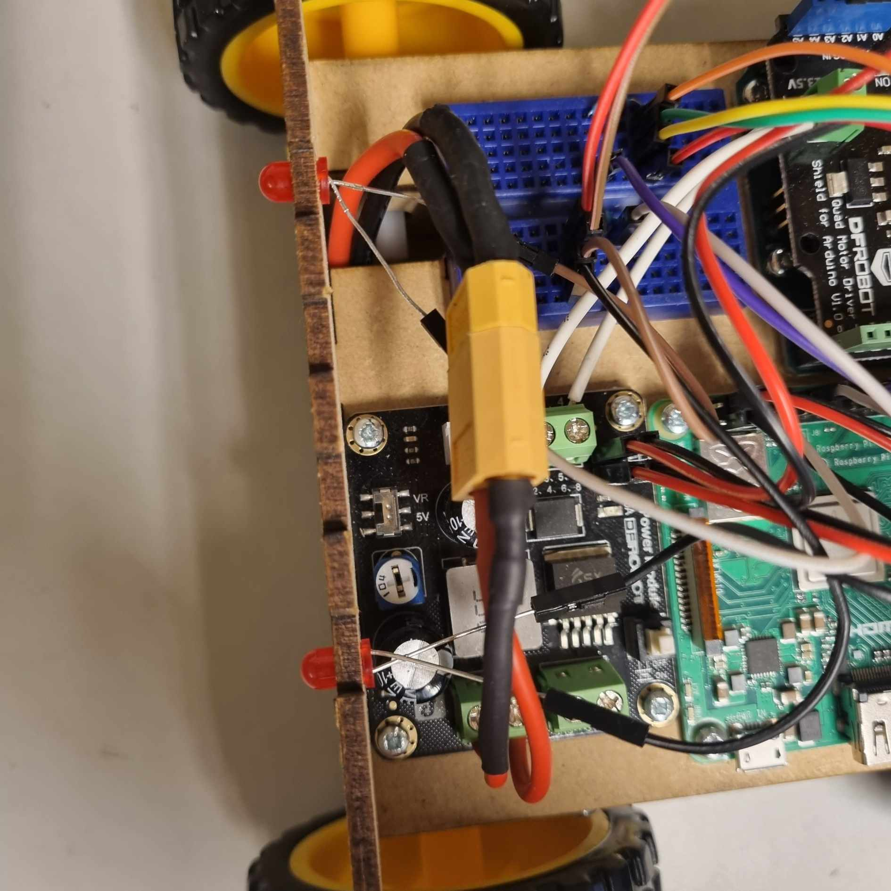
</p>

### Steg 12: Montering av bakplate og topplokk

Fest bakplaten og sett på toppdekslet. Bilen skal nå se ut som vist under.

<p align="center">
  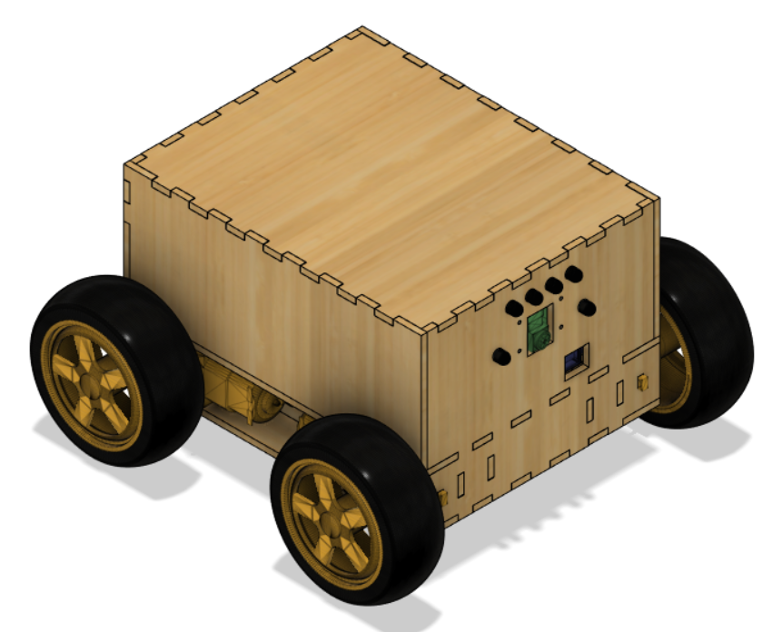
  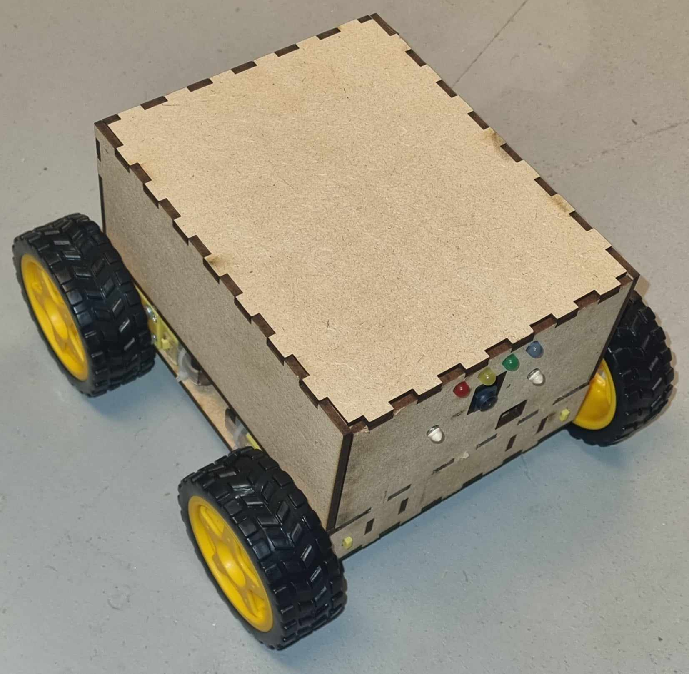


</p>

## Arduino
Arduino er en open-source elektronikkplattform basert på brukervennlig hardware og software. Arduinokortene er utrustet for å lese ulike inputs - lys fra en sensor, knappetrykk, en Twittermelding – og bruke disse dataene til å sende et outputsignal – aktivere en motor, tenne en LED, publisere noe på nettet. Dere kan instruere kortet om hva det skal gjøre ved å sende et sett med instruksjoner til mikrokontrolleren på kortet i form av kodesnutter. Disse instruksjonene sendes til kortet via en USB-kabel fra PCen din, men for at denne informasjonen skal lastes opp korrekt, må vi ha koden vår i en Arduino Software (IDE).

### Skaff Arduino Software til egen PC

Last ned Arduino IDE
* [Windows](https://docs.arduino.cc/software/ide-v1/tutorials/Windows#download-the-arduino-software-ide)
* [MacOS](https://docs.arduino.cc/software/ide-v1/tutorials/macOS?_gl=1*17wzpvg*_ga*MTY2NjU1MjEzOC4xNjI5OTYzMDk1*_ga_NEXN8H46L5*MTY1NTIwNjQyMy4zMy4xLjE2NTUyMDk1MTcuNjA.)
* [Linux](https://docs.arduino.cc/software/ide-v1/tutorials/Linux?_gl=1*xpugwf*_ga*MTY2NjU1MjEzOC4xNjI5OTYzMDk1*_ga_NEXN8H46L5*MTY1NTIwNjQyMy4zMy4xLjE2NTUyMDk1NDcuMzA.)

### Last inn koden til Arduinoen
Utstyr:
1. PC
2. Usb-A til usb-b kabel
3. Arduino Uno

Oppsett:
1. Koble Arduino-kortet til PCen din med en USB-B kabel
2. Sørg for at programvaren er satt opp for riktig type Arduino-kort, i dette tilfellet Arduino Uno
    * Gå inn på «Verktøy»/«Tools»
    * Velg riktig kort og port (porten refererer til hvilken inngang/utgang dere bruker på PCen. Det kan oppstå en feilmelding hvis feil port er valgt)

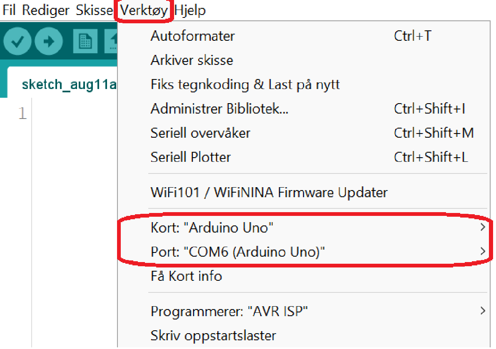

3. Erstatt deretter den eksisterende teksten med koden under:

    <details>
    <summary>Klikk her</summary>

    ```c
    //MOTOR SETUP
    const int E1 = 3; ///<Motor1 Speed - Front Right
    const int E2 = 11;///<Motor2 Speed - Front Left
    const int E3 = 5; ///<Motor3 Speed - Back Right
    const int E4 = 6; ///<Motor4 Speed - Back Left

    const int M1 = 7; ///<Motor1 Direction - Front Right
    const int M2 = 8;///<Motor2 Direction - Front Left
    const int M3 = 12; ///<Motor3 Direction - Back Right
    const int M4 = 4; ///<Motor4 Direction - Back Left

    /////////LOGIC/////////////////////////////////
    //INPUT PINS
    int drive = A0;
    int reverse = A1;
    int leftTurn = A2;
    int rightTurn = A3;

    //BOOLS
    int go = 0;
    int back = 0;
    int left = 0;
    int right = 0;


    //SPEEDS
    int drivingSpeed = 150;
    int turningSpeed = 50;

    enum Motor {
      MotorRight,
      MotorLeft,
      MotorBoth
    };

    //////DRIVING FUNCTIONS//////////////////////
    void speedSet(Motor motor, int Speed) {
        if(motor == MotorRight){
            analogWrite(E1, Speed);
            analogWrite(E3, Speed);
        }
        else if(motor == MotorLeft){
            analogWrite(E2, Speed);
            analogWrite(E4, Speed);
        }
        else if(motor == MotorBoth){
            analogWrite(E1, Speed);
            analogWrite(E2, Speed);
            analogWrite(E3, Speed);
            analogWrite(E4, Speed);
        }
    }

    //DRIVING FUNCTION
    void driving(Motor motor, bool Direction) {
        if (motor == MotorBoth){
            Direction = !Direction;
            digitalWrite(M1, Direction);
            digitalWrite(M2, Direction);
            digitalWrite(M3, Direction);
            digitalWrite(M4, Direction);
        }
        else if (motor == MotorRight){
            digitalWrite(M1, Direction);
            digitalWrite(M3, Direction);
        }
        else if (motor == MotorLeft){
            digitalWrite(M2, Direction);
            digitalWrite(M4, Direction);
        }
    }


    ////SETUP///////////////////////
    void setup() {
      Serial.begin(9600);   
      Serial.println("Starting session...");

      //SET PINS 
      pinMode(drive, INPUT_PULLUP);
      pinMode(reverse, INPUT_PULLUP);
      pinMode(leftTurn, INPUT_PULLUP);
      pinMode(rightTurn, INPUT_PULLUP);

      for(int i=3;i<=8;i++) {
          pinMode(i,OUTPUT);
          digitalWrite(i, LOW);  // Initiate as LOW
      }

      for(int i=11;i<=13;i++) {
          pinMode(i,OUTPUT);
          digitalWrite(i, LOW);  // Initiate as LOW
      }
    }


    void loop() {
    //UPDATING THE BOOLEANS
    go = digitalRead(drive);
    back = digitalRead(reverse);
    left = digitalRead(leftTurn);
    right = digitalRead(rightTurn);


    /////FORWARD DRIVE/////////////////////////////////////////
    if (go && !back) {  
        driving(MotorBoth, 0);  
        if (right) {
            speedSet(MotorRight, turningSpeed);
        } else if (left) {
            speedSet(MotorLeft, turningSpeed);
        } else {
            speedSet(MotorBoth, drivingSpeed);
        }
    }


    //REVERSE
    else if(back && !go){
        driving(MotorBoth, 1);
        //REVERSE WITH RIGHTTURN
        if(right){
        speedSet(MotorRight,turningSpeed);
        }
        //REVERSE WITH LEFTTURN
        else if(left){
        speedSet(MotorLeft, turningSpeed);
        }
        else{
        speedSet(MotorBoth, drivingSpeed);      
        Serial.println("REVERSE");
        }
    }


    //RIGHTTURN
    else if(right && !go && !back){
        speedSet(MotorBoth, turningSpeed);
        if(!left){
        digitalWrite(M1,1);
        digitalWrite(M3,1);
        digitalWrite(M2,0);
        digitalWrite(M4,0);
        Serial.println("RIGHTTURN");
        }
        
        //IF YOU PRESS BOTH LEFT AND RIGHT
        else{
        driving(MotorBoth, 0);
        }
    }

    //LEFTTURN
    else if(left && !go && !back){
        speedSet(MotorBoth, turningSpeed);
        if(!right){
        digitalWrite(M1,0);
        digitalWrite(M3,0);
        digitalWrite(M2,1);
        digitalWrite(M4,1);
        Serial.println("LEFTTURN");
        }

    //IF YOU PRESS BOTH LEFT AND RIGHT
        else{
        driving(MotorBoth, 0);
        }
    }

    //IF YOU DON'T PRESS ANYTHNIG
    else{
        speedSet(MotorBoth, 0);
        Serial.println("STOP");
    }
    }

    </details>


4. Last opp koden til Arduino-kortet. Klikk først på det blå ikonet for å verifisere koden (dobbeltkontroller at det ikke er noen feil med koden). Deretter klikker dere på det røde ikonet for å laste opp koden.
<p align='center'>
  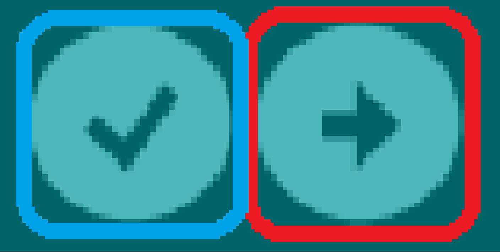
</p>
NB: Hvis motoren går i feil retning når dere tester den fullstendige oppkoblingen, er det sannsynligvis noe feil i oppkoblingen (enten feil motor koblet til feil port, eller feil på +/- ved inngangene på motordriveren). Dette kan dere prøve å rette på i Arduino-koden under «MOTOR SETUP», for å unngå å måtte gjøre omkoblinger, og for en liten ekstra utfordring. :)


## Raspberry Pi oppsett

I dette prosjektet bruker vi modellen Raspberry Pi 3B+. Denne brukes til å lage en webserver som streamer live-video fra et Raspberry-kamera, og hvor dere, mens dere er i nettleseren, kan bruke piltastene til å styre bilen. Dette gjøres ved at dere sender informasjon om tastetrykkene til Pi-en, som igjen sender informasjon til Arduinoen, som er et mikrokontrollerkort. I dagligtale er det, i et slikt prosjekt, vanlig å referere til Pi-en som hjernen, som bruker Arduino som slave. Som alle andre datamaskiner har også denne et operativsystem, eller OS. Raspberry Pi sitt OS ligger på et SD-kort, som er mulig å ta ut og inn. Dette SD-kortet fungerer også som maskinens harddisk. Derfor starter prosessen med å klargjøre Raspberry Pi-en med å sette opp SD-kortet.

### Sette opp SD-kortet

Utstyr:

- Laptop
- SD-kort
- SD-kortleser

SD-kortene dere har fått utdelt inneholder ingen informasjon dere kan bruke. Derfor må dere starte med å laste opp et OS til dette kortet. RPi bruker ikke Windows eller MacOS, men et operativsystem som ofte kalles Rasbian/Debian, som er en versjon av Linux. For å kunne laste opp dette OS-et til kortet kreves et eget skriveprogram som heter Raspberry Pi Imager.

Slik går dere frem for å sette opp SD-kortet:

1. Last ned Raspberry Pi Imager
2. Sett inn SD-kortet inn i SD-kortleseren
3. Åpne Raspberry Pi Imager
4. Klikk på «CHOOSE OS» og velg: «Raspberry Pi OS (32-bit)»
5. Deretter «CHOOSE STORAGE», og velg det SD-kortet dere satte inn.
6. Gå inn på innstillinger:

   

   1. Sett hostname til «elsys"gruppenummer"», eksempel: elsys14
   2. Enable SSH
      - Use password authentication
   3. Set username and password
      - Username: pi, NB: viktig at dere kun skriver “pi”
      - Password: "123", eller noe annet dere lett kan huske
   4. Configure wireless LAN
      - NB: SSID og Passord må være identisk med det nettverket dere kan dele fra mobilen
   5. Enable Set locale settings:
      - Time zone: Europe/Oslo
      - Keyboard layout: no
   6. Når dere er ferdig skal dere se noe tilsvarende:

   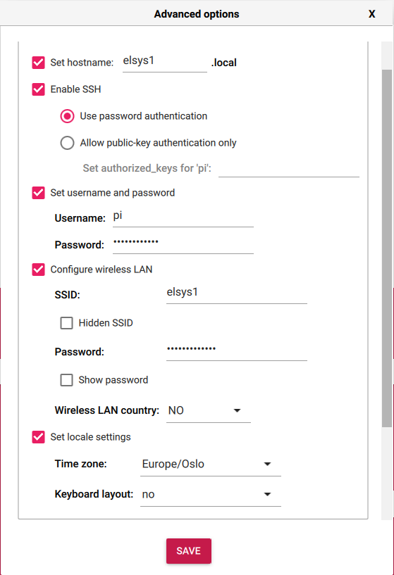

7. Lagre innstillingene, og trykk på write. Dette kan ta litt tid.
8. Når SD-kortet er ferdig skrevet vil dere få en beskjed om at det er trygt å ta det ut av maskinen. Ta det ut, og sett inn i Pi-en.


### Sette opp Raspberry Pi headless
Som nevnt er Raspberry Pi en datamaskin, men som dere kanskje ser er det ikke akkurat en bærbar PC. Det fine med Raspberry Pi er at den kan settes opp og styres uten skjerm, det vil si at man verken trenger en ekstern skjerm eller tastatur. For å bruke den uten skjerm tar vi i bruk Secure Shell Protocol, også kjent som SSH, som dere aktiverte i “Advanced options”. For å koble til Pi-en fra PC-en med SSH, må begge enhetene være koblet til samme nettverk. Derfor skal vi dele nett fra mobilen, og koble oss til dette nettet med både Pi og PC.

Tips til terminal:
- Grunnleggende terminalkommandoer for navigering:
  - **`cd <directory>`**: Bytter katalog. Denne kommandoen lar deg navigere mellom forskjellige kataloger (mapper) på datamaskinen din. For eksempel, `cd Documents` vil navigere til Documents-mappen fra din nåværende lokasjon.
  - **`ls`**: List opp innholdet i den nåværende katalogen. Denne kommandoen viser alle filer og mapper i den nåværende katalogen.
  - **`cd ..`**: Gå opp ett nivå i katalogstrukturen. Dette tar deg tilbake til mappen som inneholder den nåværende mappen.


Utstyr:
- PC
- Raspberry Pi med ferdig installert SD-kort
- Delt nett

#### SSH inn til Raspberry Pi

1. Først må Pi-en være koblet til strøm. Dette gjøres enten ved oppkobling i bilen eller ved mikro-USB-porten på kortet.
2. Åpne en terminal på laptopen:
   - For Windows kan dere søke opp:
     - Terminal (🪟 + x)
     - Windows PowerShell
     - Command Promt
   - For Mac kan dere søke opp:
     - Terminal
3. For å SSH inn til Pi-en går dere inn på terminalen og skriver:
  ```bash
  ssh pi@<hostname>.local
  ```
bytt ut <hostname> med det dere satte i Raspberry Pi imager F.eks:
   ```bash 
   ssh pi@elsys1.local 
   ```
NB: Det kan ta litt tid før Pi-en starter, så om den ikke finner Pi-en med en gang, vent noen minutter og prøv igjen. Dere kan også trykke piltast opp på tastaturet for å bruke den siste kommandoen dere brukte. Dobbeltsjekk også at det delte nettet opererer på 2.4GHz.

Når den spør om dere ønsker å koble til, skriv “yes” og trykk enter.

Når dere skriver inn passordet, vil dere merke at det ikke kommer opp noe "***". Dette er normalt, bare skriv passordet som vanlig.

Dere vil få opp noe liknende dette:
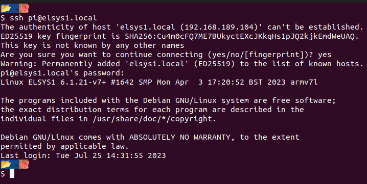

Gratulerer, dere har nå logget på Raspberry Pi via SSH. Kommandoene dere nå skriver utføres inne på selve Raspberry Pi.

#### Enable camera
Aktiver kameraet på RPI-en med kommandoen:

```bash
sudo raspi-config
```

- Naviger til "Interface Options", deretter "Legacy Camera"
  - Velg "Yes" til å enable kamera
  - Start Pi-en på nytt med
```bash
sudo reboot now
```
#### Få inn riktig programvare

1. Dere kan nå oppdatere og oppgradere med kommandoene

```bash
sudo apt-get update && sudo apt-get dist-upgrade -y
```


2. Dere kan nå klone git-repositoriet som inneholder koden som Raspberry Pi-en skal kjøre, med kommandoen:

```bash
git clone https://github.com/PeterhdPham/teknobil2023.git
```

3. Deretter kan dere navigere til "Teknostart"-mappen med kommandoen:
   
```bash 
cd teknobil2023/
```
<p>
  

Merk at det i blått angir hvilken mappe dere befinner dere i. Prøv kommandoen 'cd ..' for å gå tilbake eller 'ls' for å vise hvilke andre filer eller mapper som er tilgjengelige.
</p>
    

4. Last ned den ekstra programvaren som kreves for å kjøre koden, med kommandoen:

```bash
pip3 install -r requirements.txt && sudo apt-get install libatlas-base-dev -y && sudo apt-get install python3-pyro4 -y
```

5. Når nedlastingen er fullført, kan dere navigere videre til "projectfolder" med kommandoen:

```bash
cd projectfolder/
```
6. Når Arduino-koden er ferdig lastet opp, kan dere kjøre Python-koden med kommandoen:

```python
python runCode.py
```

Ved å kjøre denne kodelinjen får dere opp en IP-adresse som dere kan gå til i nettleseren for å få videofeed og kjøre bilen. Når dere skal stoppe koden fra å kjøre, trykk "STOP" i nettleseren. For å teste objektgjenkjennelsen, trykk "COMPARE"


# Utvidelser

Når dere har fullført bilbyggingen, er det på tide å tilpasse bilen og legge til de utvidelsene dere ønsker. Utvidelsene er listet her i en rekkefølge vi mener går fra lavest til høyest nivå, men dere kan utføre dem i hvilken som helst rekkefølge. Dere kan også velge å hoppe over utvidelsene og begynne direkte med dekorasjonen. Hvis dere har andre ideer til utvidelser og trenger andre komponenter enn det som er tilgjengelig, ta kontakt med en læringsassistent. Platene kan kuttes, bores og modifiseres etter ønske, men husk at elektronikken inni skal gjenbrukes til neste år.


## Hastighet

Det er mulig å endre bilens hastighet både i Arduino-koden og ved å endre motorspenningen. Økt hastighet kan være en stor fordel hvis dere ønsker å vinne raskeste bil. Men sørg for å teste underveis slik at dere fortsatt har kontroll.

### Kode

Bilens hastighet er definert i Arduino-koden i linjene nedenfor.

```c
//SPEEDS
int drivingSpeed = 150;
int turningSpeed = 50;
```

Bla ned til dere finner dette i koden din, og lek med tallverdiene. Med hvilke verdier er bilen raskest?
### Omkobling av motorspenning

En annen måte å øke bilens hastighet på er ved å øke spenningen til motorene. Slik bilen er koblet opp nå, er motordriveren koblet til 5 V fra regulatoren, det samme som Arduino og Raspberry Pi. Men vi kan enkelt koble om spenningen til motordriveren slik at den er koblet direkte på batterispenningen. Bruk dokumentasjonen for spenningsregulatoren som dere finner [her](https://wiki.dfrobot.com/Power_Module__SKU_DFR0205_) til å gjøre dette.


## Tutehorn

Det er gøy å tute. Det synes alle. Dere kan få en buzzer utdelt fra en læringsassistent. Koden for at dette skal fungere på bilen deres er allerede skrevet, men den er kommentert ut i filen runCode.py. Dere må lese gjennom koden for å finne ut hvordan tutehornet fungerer. Målet med denne oppgaven er ikke at dere skal forstå all koden, men få erfaring med å endre filene dere har på Pi-en. Programmet runCode er skrevet i programmeringsspråket Python som dere vil lære etter hvert.

1. Koble opp buzzeren med siden som er merket med + til GPIO 21 på Raspberry Pi og den andre siden koblet til GND.
2. Nå må vi endre programmet runCode.py. Nano er en teksteditor som dere kan kjøre fra terminalen. Åpne runCode i nano.
   
```bash
nano runCode.py
```

I Nano kan dere navigere med piltastene og bla ned gjennom koden. I Python kan vi kommentere ut ved å plassere # foran teksten vi ønsker å kommentere. Da kommenterer vi ut den ene linjen vi skriver på. Skal vi kommentere ut flere linjer bruker vi """ <teksten her ignoreres av Python> """.

Første kodesnutt som er kommentert bort er vist under. Fjern """ begge steder slik at koden ikke er kommentert bort.

```p
# ------------------------
"""
# Buzzer setup
BUZZER = 12
GPIO.setup(BUZZER, GPIO.OUT)
buzzer = GPIO.PWM(BUZZER, 1000) # Set frequency to 1 kHz
"""
# ------------------------
```

Det er tre slike kommentarer som må fjernes. Dere må nå finne de to andre og gjøre det samme med dem. De er markert på samme måte som koden over.

3. Når dere har fjernet alle tre kommentarene, lukk Nano ved å trykke Ctrl+X, deretter Y for å lagre og så Enter. Nå kan dere kjøre koden på nytt og kjøre rundt som før. Når dere trykker Space, skal buzzeren spille av en vakker lyd.
4. Nå kan dere prøve å sette en annen frekvens eller duty cycle for buzzeren.


## Lobe

Lag deres egen modell for objektgjenkjenning. Det vi kaller "object detection", eller objektgjenkjenning, er en teknikk en datamaskin bruker for å lokalisere objekter i bilder eller videoer. Vi mennesker gjenkjenner raskt ulike objekter i bilder og videoer, og skiller dem fra hverandre i løpet av millisekunder. Målet med "object detection" er å kunne gjenskape denne egenskapen i en datamaskin. For å oppnå dette er det ofte brukt machine learning, som innebærer at maskinen lærer seg selv opp.

For å slippe å skrive egen kode for dette skal vi benytte et open-source program kalt LOBE. I dette programmet kan man legge inn bilder av de objektene man ønsker at maskinen/programmet skal kunne kjenne igjen, og sette merkelapp på dem. Disse bildene vil så LOBE bruke til å trene opp en modell (type program), til den klarer å kjenne igjen alle objektene den har merkelapp til. Denne modellen, i form av en mappe, legger vi inn på vår RPi, og dere vil ha en egenlaget og fungerende gjenkjenningsmodell når dere kjører bilen!


###	Last ned lobe og tren deres første modell
-	Last ned [lobe](https://www.lobe.ai/) 

Når dere har lastet ned, kan dere åpne programmet og starte et "New Project".


<p align="center">
  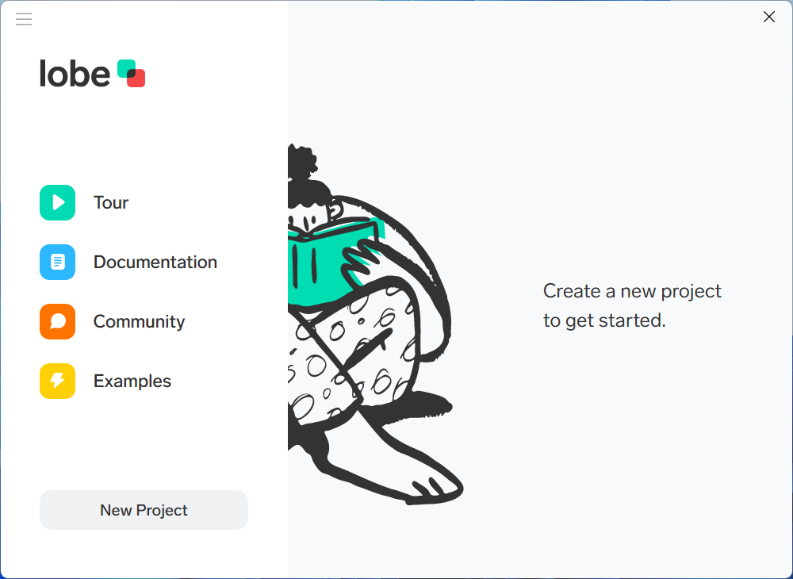
</p>

Importer nedlastet mappe [dataset](https://github.com/PeterhdPham/teknobil2023/dataset) fra GitHub-repositoriet og importer dette inn i Lobe. Når programmet spør hvordan dere ønsker å kategorisere bildene, velger dere "Label using folder name". Når dere har importert bildene ferdig, kan dere trykke på "Train" for å se programmet trene en AI-modell.

Dersom den skulle slutte å trene før den har nådd "Correct 100%", kan dere trykke på det første bildet og korrigere den til riktig label.

<p align="center">
  
</p>

Når modellen deres har en prediksjon på 100%, kan dere eksportere modellen deres via Use>Export>"TensorFlow Lite".

<p align="center">
  
</p>

Dere kan også velge å optimalisere den før den blir eksportert.

Etter å ha eksportert den, må dere bytte navn på mappen til "Lobe". Denne brukes i koden for RPi-en, derfor er det viktig å gi denne mappen navnet «Lobe», og plassere denne et sted dere husker!

### Overfør modellen over til Raspberry pi 
3.	For å få denne inn i mappestrukturen til RPi-en deres slik at modellen deres faktisk blir brukt, må den erstatte den modellen som allerede ligger inne. Derfor er det nødvendig å laste ned et skrivebordsprogram som lar deg overføre filer og mapper mellom to maskiner, her egen PC og RPi.

    1.	Last ned [FileZilla](https://filezilla-project.org/)
    2.	Åpne programmet når nedlastningen er ferdig
    3.	Fyll inn Vert (Hostname), brukernavn, passordet til RPi-en deres og port: 22 for å få en tilkobling. Det vil da komme opp mappestrukturen til RPi-en på venstre side av programvinduet

<p align="center">
  
</p>

4.	Erstatt Lobe-mappen som ligger inne i mappen teknobil2023.

<p align="center">
  
</p>

Til høyre har dere mappestrukturen til Raspberry Pi, mens den til venstre er deres lokale PCs mappestruktur.

<p align="center">
  
</p>


Når dere kjører «runCode.py» fra RPi-en nå, vil den ta i bruk deres egen "object detection"!

### Utvid modellen med deres egne bilder
Fram til nå har vi ledet dere gjennom hele prosessen og vi har forberedt alt slik at dere skal få mest mulig friksjonsfritt og mindre "stangete" enn deres fremtidige "broedre iitem systre" fra KYB (Deres teknostart er desidert mye kulere enn dems, GO ELSYS!😎). Men nå er det deres tur til å gjøre noe selvstendig (ikke helt. lol)


### Last ned riktig programvare for å kunne ta bilder med RPi
Bildene som skal brukes til å lage denne modellen skal tas med RPi, og for å få lagret disse lokalt på PC-en skal vi benytte en ny programvare som lastes ned på Raspberry Pi:

```bash
cd
git clone https://github.com/silvanmelchior/RPi_Cam_Web_Interface.git
cd RPi_Cam_Web_Interface
./install.sh
```

Under nedlastingen vil dere få opp denne menyen:

<p align='center'>
 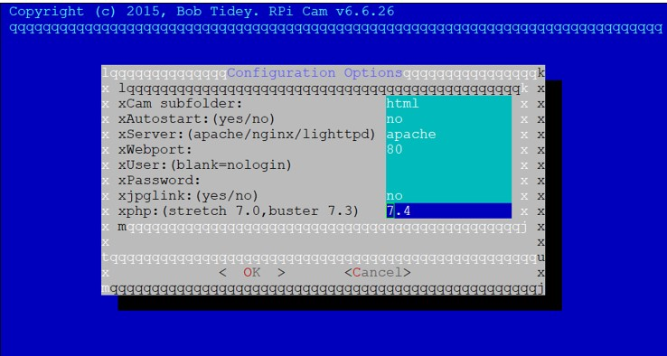

Sørg for at alle parametere er like som på bildet over!

### Ta bilder
1.	Start programvaren med å skrive kommandoen 
```bash
/.start.sh
```

2.	Åpne en ny fane i nettleseren og bruk IP-adressen til RPi-en din som nettstedsøk. Hvis dere ikke kjenner til IP-adressen fra før, kan dere finne den ved å bruke følgende kommando:

```bash
ifconfig
```

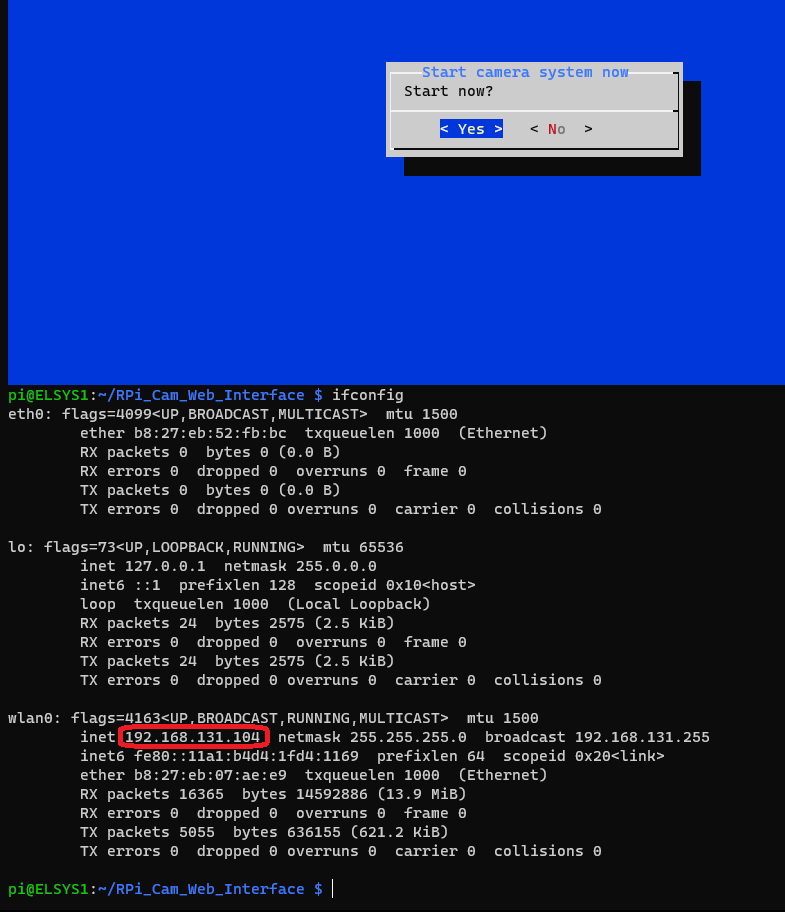

På stedet som er markert i rødt vil IP-adressen vises. Skriv IP-adressen sammen med "/html/", for eksempel (http://192.168.131.104/html/).


4.	Innenfor "camera settings" > "Annotation", kan dere fjerne annotasjonen. Trykk på "record image" for å ta bilder. Dere kan også bruke "timelapse" for å slippe å ta bilder manuelt.

Tips for å lage den best mulige gjenkjenningsmodellen:

-	Ta mange bilder av hvert objekt.
-	Ta gjerne bilder fra ulike vinkler.
-	Vurder å ta bilder med ulike bakgrunner/underlag.

5.	For å laste ned, trykk på "Download Videos and Images" > "Select All" > "Get Zip".

Dette vil bli lastet ned lokalt på PC-en din, velg en filplassering dere vil huske.

### Oppdater gjenkjenningsmodellen
1. Åpne Lobe.
2. Velg det allerede eksisterende prosjektet.
3. Importer de nye bildene dere nettopp tok.
4. Velg alle bildene og sett "label" til å være "elsys", husk å kun bruke små bokstaver!
5. Når alle bildene har fått en etikett, gå til "Train" og vent til denne har nådd 100%.
6. Dere kan nå eksportere og overføre mappen til Raspberry Pi-en, akkurat som dere gjorde forrige gang.

